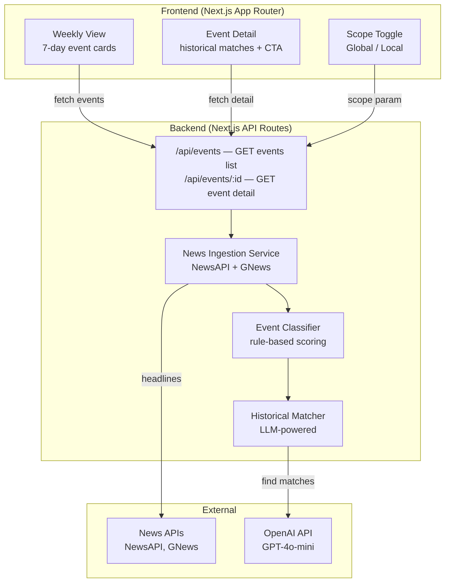

## Overview

Build a clean, modern web application called "Trade the Past" that connects current financial news with similar historical events and shows how markets reacted in the past.

The app aggregates headlines from multiple news APIs (global + UK/DE/FR local), detects high-impact market events (earnings, layoffs, regulation, geopolitical, etc.), selects one key event per day, and uses an LLM to find 1–3 similar past events with market reaction data.

The frontend has two views:
1. **Weekly View** — shows the last 7 days, one event card per day (title, type badge, image)
2. **Event Detail** — shows the event, its historical match(es), market reaction table (asset, direction, Day 1, Week 1), a short insight, and a single clear CTA

A Global/Local toggle lets users switch between global news and local sources (UK, DE, FR). No auth, no archive, no infinite scroll.

## Acceptance Criteria

- [ ] Backend ingests headlines from at least 1 news API and classifies them by event type
- [ ] Event detection selects 1 high-impact event per day from aggregated headlines
- [ ] Historical matching returns 1–3 similar past events per selected event with a "why similar" explanation
- [ ] Market reaction data is included for each historical match (affected assets, direction, Day 1 and Week 1 performance)
- [ ] Weekly view displays the last 7 days with one event card per day (title, type, image)
- [ ] Event detail page shows the event, historical matches, market reaction table, insight text, and a single CTA
- [ ] Global/Local toggle switches between global and local (UK, DE, FR) news scope
- [ ] Images display: news source image when available, placeholder fallback otherwise
- [ ] UI is clean, modern, and editorial — no emojis, no infinite scroll, no archive
- [ ] The app runs as a working MVP end-to-end (backend API + React frontend)

## Research Notes

### News APIs
- **NewsAPI.org** (free tier): 100 req/day, 24h article delay, localhost CORS only, dev use only. Endpoints: `/v2/top-headlines`, `/v2/everything`. Up to 1 month historical search.
- **GNews** (free tier): 100 req/day, 10 articles/request, 12h delay, localhost CORS only, dev use only. Endpoints: `/api/v4/top-headlines`, `/api/v4/search`.
- Both free tiers are dev-only — MVP will start with mock data and add real API integration as a separate task. Need to cache aggressively to stay within limits.

### LLM for Historical Matching
- OpenAI GPT-4o-mini is cost-effective for structured historical matching prompts.
- The LLM generates similar events from its training data — no external historical database needed for MVP.
- Structured output (JSON mode) ensures reliable parsing of market reaction data.

### Tech Stack Decision
- **Next.js 14+ (App Router)** — full-stack: React frontend + API routes for backend
- **Tailwind CSS** — editorial, clean styling
- **TypeScript** — shared types across frontend/backend
- No database for MVP — in-memory mock data first, then real API calls cached in memory

## Assumptions
- Free-tier API keys will be provided via `.env` before the news ingestion task runs
- The LLM (OpenAI) API key will be provided via `.env` before the historical matching task runs
- Market reaction data from the LLM is illustrative (based on LLM training data), not from a financial data provider

## Architecture Diagram

## One-Week Decision

**NO** — This project spans full-stack (Next.js scaffold, two frontend views with editorial design, news API integration, LLM-powered historical matching, scope toggle, image handling). Estimated at 5–7 days of focused work. Splitting into 5 vertical slices for reliable execution.

## Split Rationale

Split into 5 sequential tasks:
1. **Scaffold** — Next.js project, shared types, mock data layer, routing, basic layout
2. **Frontend UI** — Both views (weekly + detail) built against mock data, editorial styling
3. **News ingestion** — Real news API integration, event classification, scoring
4. **Historical matching** — LLM integration, similar event finding, market reaction data
5. **Integration + polish** — Wire real backend, scope toggle, image handling, final UX
