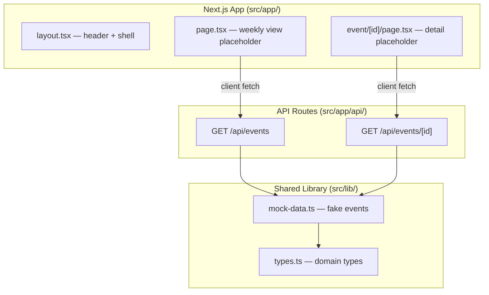

## Overview

Set up the Next.js 14+ project with App Router, Tailwind CSS, TypeScript, shared domain types, a mock data service that returns realistic fake events, and the basic routing/layout structure.

This task produces a running app shell at port 3050 with placeholder pages and a working mock API.

## Acceptance Criteria

- [ ] Next.js 14+ app with App Router, TypeScript, Tailwind CSS initialized
- [ ] Shared TypeScript types defined: `MarketEvent`, `HistoricalMatch`, `MarketReaction`, `EventType` enum
- [ ] Mock data service returns 7 days of realistic fake events with historical matches
- [ ] API routes: `GET /api/events` (list) and `GET /api/events/[id]` (detail) serving mock data
- [ ] App layout with header ("Trade the Past" branding) and clean shell
- [ ] Routes: `/` (weekly view placeholder) and `/event/[id]` (detail placeholder)
- [ ] Dev server runs on port 3050
- [ ] All TypeScript compiles without errors

## Research Notes

- Next.js 14+ App Router with `src/app/` directory structure
- Tailwind CSS v3 via `@tailwindcss/postcss` or built-in Next.js support
- Port 3050 configured via `next dev -p 3050` in package.json scripts
- Mock data uses realistic financial events (e.g. "Fed raises rates", "Tesla earnings beat")

## Architecture Diagram

## One-Week Decision

**YES** — This is a straightforward scaffold task: `create-next-app`, define types, write mock data, create 2 API routes, 2 page shells, and a layout. Estimated 3–4 hours.

## Implementation Plan

### Phase 1 — Initialize project
- Run `npx create-next-app@latest` with TypeScript, Tailwind, App Router, src directory
- Configure port 3050 in package.json dev script

### Phase 2 — Define domain types
- Create `src/lib/types.ts` with `EventType` enum, `MarketEvent`, `HistoricalMatch`, `MarketReaction` interfaces

### Phase 3 — Mock data service
- Create `src/lib/mock-data.ts` with 7 realistic market events spanning the current week
- Each event has 1–3 historical matches with market reaction data

### Phase 4 — API routes
- `src/app/api/events/route.ts` — returns event list (summary fields only)
- `src/app/api/events/[id]/route.ts` — returns full event with historical matches

### Phase 5 — Layout and pages
- `src/app/layout.tsx` — header with "Trade the Past" branding, clean sans-serif font
- `src/app/page.tsx` — placeholder weekly view (just renders event titles from API)
- `src/app/event/[id]/page.tsx` — placeholder detail view (just renders event data from API)
