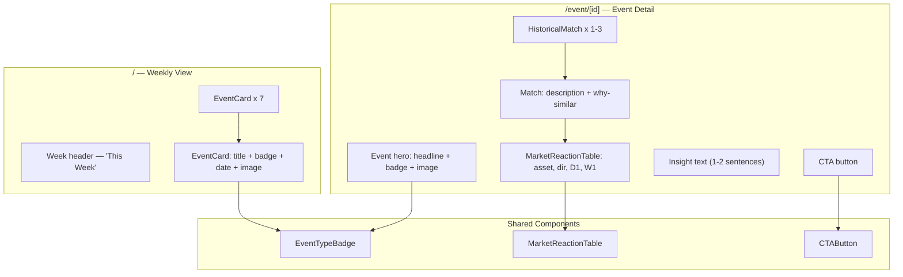

## Overview

Build the two main frontend screens against mock data: the Weekly View (main screen showing 7 days of event cards) and the Event Detail page (event headline, historical matches, market reaction table, insight, CTA). Style with an editorial, magazine-like feel — clean typography, restrained color, no emojis.

## Acceptance Criteria

- [ ] Weekly View (`/`) shows 7 day-cards in a clean layout, each with: event title, event type badge, date, thumbnail image
- [ ] Clicking a day-card navigates to `/event/[id]`
- [ ] Event Detail page shows: event headline, type badge, full image, date
- [ ] "Similar Past Events" section with 1–3 historical matches, each showing: event description, "why similar" text
- [ ] Market reaction table per match: columns for Asset, Direction (up/down indicator), Day 1 %, Week 1 %
- [ ] Short insight text (1–2 sentences) below each match
- [ ] Single prominent CTA button at the bottom of the detail page
- [ ] Editorial design: clean serif/sans-serif typography, muted color palette, generous whitespace
- [ ] Responsive layout (desktop-first, readable on tablet)
- [ ] Images: display source image when available, themed placeholder fallback
- [ ] No emojis, no infinite scroll, no archive navigation

## Research Notes

- Use Next.js `<Image>` component for optimized image loading with fallback
- Event type badges: colored pill/tag components with muted tones per category
- Market reaction table: direction shown with subtle arrow icons and green/red coloring
- Google Fonts: use a quality serif (e.g. Playfair Display or Lora) for headlines, system sans-serif for body
- CTA designs: full-width button at bottom of detail page, dark/contrasted

## Architecture Diagram

## One-Week Decision

**YES** — Two pages with shared components, styled with Tailwind. Data already available from mock API. Estimated 1–2 days.

## Implementation Plan

### Phase 1 — Shared components
- `EventTypeBadge` — colored pill showing event type
- `MarketReactionTable` — table with asset, direction arrow, Day 1 %, Week 1 %
- `CTAButton` — prominent action button

### Phase 2 — Weekly View page
- Fetch events from `/api/events`
- Render 7 cards in a vertical or grid layout
- Each card: date, title, type badge, thumbnail
- Link to `/event/[id]`

### Phase 3 — Event Detail page
- Fetch from `/api/events/[id]`
- Hero section with headline, badge, image
- Historical matches section with reaction tables
- Insight text
- CTA at bottom

### Phase 4 — Typography and polish
- Add Google Font (serif for headlines)
- Muted editorial color palette
- Responsive breakpoints
- Image fallback placeholders
