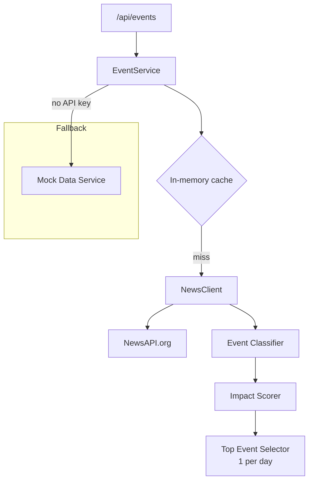

## Overview

Replace mock news data with real headlines from NewsAPI.org (primary) and optionally GNews (fallback). Implement rule-based event classification that categorizes headlines into event types (earnings, layoffs, regulation, geopolitical, etc.), scores them by impact, and selects the top event per day.

## Acceptance Criteria

- [ ] NewsAPI.org integration fetches top headlines and business/finance articles
- [ ] Headlines are classified into event types: earnings, layoffs, lawsuits, regulation, interest-rates, geopolitical, commodity-shocks
- [ ] Impact scoring ranks events (keyword density, source authority, headline phrasing)
- [ ] One top event is selected per day from scored candidates
- [ ] Global vs Local scope parameter filters sources (Global = all, Local = UK/DE/FR sources)
- [ ] API key read from `.env` (`NEWSAPI_KEY`)
- [ ] Graceful fallback to mock data when API key is missing or rate-limited
- [ ] Caching layer to minimize API calls (in-memory, TTL-based)
- [ ] `/api/events` endpoint returns real data when API key is available

## Research Notes

- NewsAPI `/v2/top-headlines?category=business&country=us` for global
- NewsAPI `/v2/top-headlines?country=gb` / `de` / `fr` for local
- Free tier: 100 req/day, so cache aggressively (1h TTL minimum)
- Classification: keyword-based rules (e.g. "earnings" → EARNINGS, "layoff" OR "restructur" → LAYOFFS)
- Impact scoring heuristic: keyword match strength + source tier (reuters/bloomberg > others) + recency

## Architecture Diagram

## One-Week Decision

**YES** — News API client, keyword classifier, scoring heuristic, and caching. Estimated 1–2 days.

## Implementation Plan

### Phase 1 — News API client
- `src/lib/news-client.ts` — fetch from NewsAPI.org with API key from env
- Support country/scope parameter for Global vs Local
- Error handling and rate limit detection

### Phase 2 — Event classifier
- `src/lib/event-classifier.ts` — keyword-based classification rules
- Map headlines to `EventType` enum values
- Return confidence score per classification

### Phase 3 — Impact scorer and selector
- `src/lib/event-scorer.ts` — score events by keyword density, source authority, recency
- Select top-1 event per day from candidates

### Phase 4 — Caching and fallback
- In-memory cache with TTL (1 hour for free tier conservation)
- Fallback to mock data when `NEWSAPI_KEY` is unset or API errors

### Phase 5 — Wire to API route
- Update `/api/events/route.ts` to use real news service with scope parameter
- Accept `?scope=global|local` query parameter
