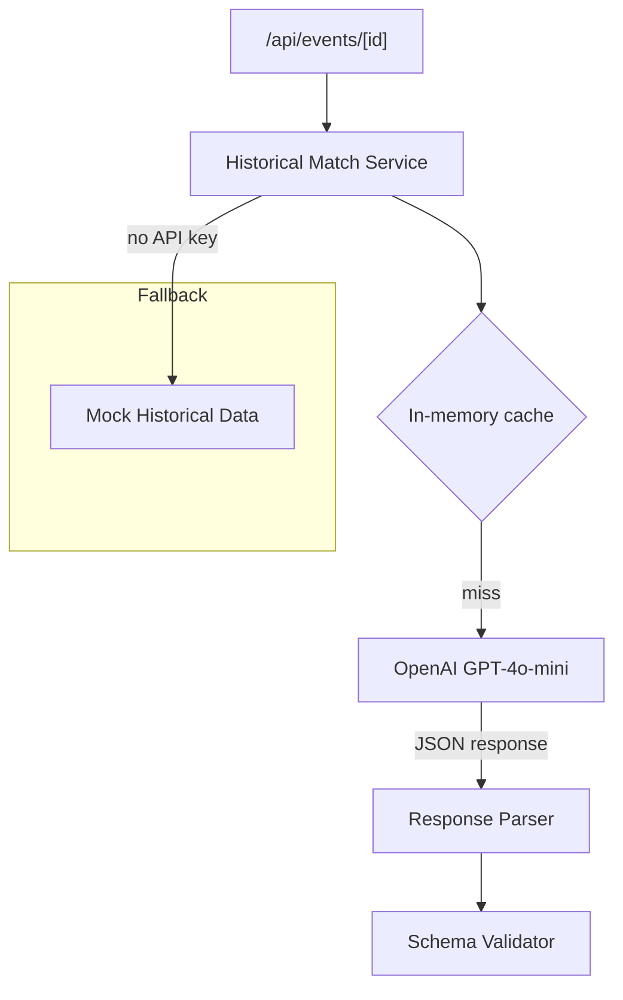

## Overview

For each selected daily event, use OpenAI GPT-4o-mini to find 1–3 similar historical events. The LLM returns structured data including: what happened, why it's similar, affected assets, market direction, and Day 1 / Week 1 performance figures. Results are cached to avoid redundant API calls.

## Acceptance Criteria

- [ ] OpenAI integration sends a structured prompt with the current event details
- [ ] LLM returns 1–3 historical matches in JSON format (using structured output / JSON mode)
- [ ] Each match includes: event description, date/year, why-similar explanation, affected assets with direction and Day 1/Week 1 % changes
- [ ] Results are cached per event (in-memory, keyed by event ID)
- [ ] API key read from `.env` (`OPENAI_API_KEY`)
- [ ] Graceful fallback to mock historical data when API key is missing
- [ ] `/api/events/[id]` endpoint includes real historical matches when available
- [ ] Prompt engineering ensures consistent, plausible output (not hallucinated ticker symbols)

## Research Notes

- OpenAI `gpt-4o-mini` with `response_format: { type: "json_object" }` for structured output
- Prompt should include: event headline, event type, affected sector/company, geography
- Output schema: array of `{ description, year, whySimilar, reactions: [{ asset, direction, day1Pct, week1Pct }] }`
- Cache key: hash of event headline + type (prevents duplicate LLM calls for same event)
- Cost estimate: ~$0.001 per call with gpt-4o-mini, negligible for MVP

## Architecture Diagram

## One-Week Decision

**YES** — OpenAI client, prompt template, JSON parsing, caching, and fallback. Estimated 1 day.

## Implementation Plan

### Phase 1 — OpenAI client
- `src/lib/openai-client.ts` — wrapper around OpenAI API with JSON mode
- API key from env, error handling for rate limits

### Phase 2 — Prompt engineering
- `src/lib/historical-prompt.ts` — structured prompt template
- Include event headline, type, sector, geography
- Request 1–3 matches with specific JSON schema
- System prompt constrains output to real historical events with plausible market data

### Phase 3 — Response parsing and validation
- Parse JSON response into `HistoricalMatch[]` type
- Validate required fields, sanitize percentages
- Fallback to mock data if parsing fails

### Phase 4 — Caching
- In-memory cache keyed by event ID
- No TTL needed (historical matches don't change)

### Phase 5 — Wire to API route
- Update `/api/events/[id]/route.ts` to call historical match service
- Include matches in event detail response
