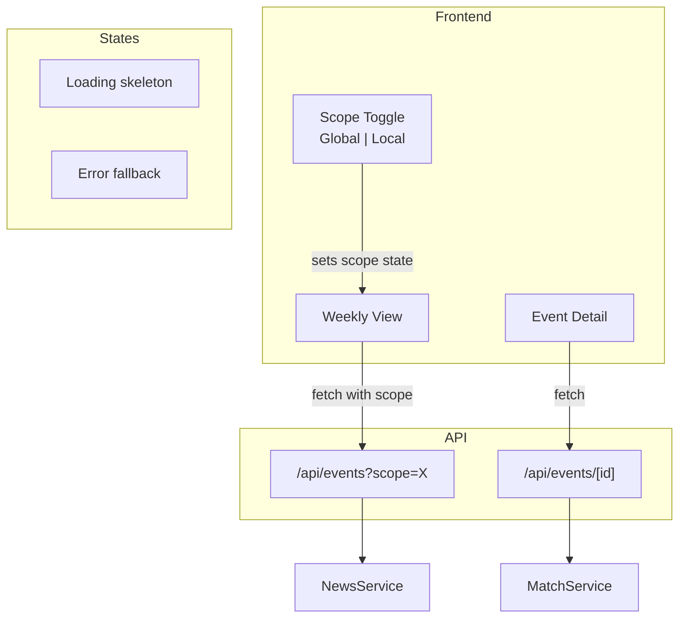

## Overview

Wire the real backend (news ingestion + historical matching) to the frontend, implement the Global/Local scope toggle, handle image display logic, and apply final UX polish. Ensure the full end-to-end flow works: events load from real APIs (or mock fallback), clicking an event shows real historical matches, and the CTA is contextually relevant.

## Acceptance Criteria

- [ ] Frontend fetches from real API endpoints (not hardcoded mock data)
- [ ] Global/Local toggle in the header switches the scope query parameter
- [ ] Local scope filters to UK, Germany, France sources
- [ ] Toggle state persists during the session (not across reloads)
- [ ] Images: news source image displayed when URL is valid, themed placeholder otherwise
- [ ] Loading states shown while fetching events and historical matches
- [ ] Error states shown gracefully when APIs fail
- [ ] CTA button text is contextual ("View affected assets" / "Explore this sector" / etc.)
- [ ] Full end-to-end flow works: weekly view → click event → detail with historical matches → CTA
- [ ] Visual polish pass: consistent spacing, typography, color, hover states
- [ ] No console errors or warnings in production build

## Research Notes

- Scope toggle: simple two-button toggle in the header, controlled via React state
- Pass scope as query param to `/api/events?scope=global|local`
- Image fallback: use `onError` handler on `<Image>` to swap to placeholder
- Loading: skeleton UI or simple spinner while data loads
- CTA text mapping: based on event type (earnings → "View affected assets", geopolitical → "Explore this sector")

## Architecture Diagram

## One-Week Decision

**YES** — Integration wiring, a toggle component, image fallback, loading/error states, and visual polish. Estimated 1 day.

## Implementation Plan

### Phase 1 — Scope toggle component
- `src/components/ScopeToggle.tsx` — Global/Local toggle with active state styling
- Lift scope state to layout or use URL search params

### Phase 2 — Wire frontend to real API
- Update Weekly View to pass scope param
- Update Event Detail to handle real data shape
- Add loading skeletons and error states

### Phase 3 — Image handling
- Image component with `onError` fallback to themed placeholder
- Placeholder varies by event type (finance icon, globe icon, etc.)

### Phase 4 — CTA logic
- Map event type to contextual CTA text
- Button links to a relevant action (or placeholder URL for MVP)

### Phase 5 — Visual polish
- Consistent spacing and typography review
- Hover/focus states on all interactive elements
- Production build test — no console errors or warnings
