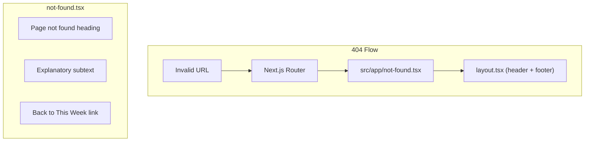

## Problem Statement

When users navigate to invalid URLs (e.g. `/event/nonexistent-id`, `/random-path`, `/event/`), they see the default Next.js 404 page: a plain "404 | This page could not be found." in system font with no app branding, no editorial styling, and no link back to the weekly view. This breaks the editorial feel of the product and leaves users stranded.

## User Story

As a user who followed a broken link or mistyped a URL, I want to see a branded, helpful not-found page so that I can easily navigate back to the weekly view without using the browser back button.

## How It Was Found

Navigated to `/event/nonexistent-event-id-12345` and `/totally-random-path` in agent-browser. Both showed the raw Next.js 404 with system font, no app header/footer context (except the layout wrapper), and no call to action to return home. Screenshot evidence in `review-screenshots/02-invalid-event.png`.

## Proposed UX

- A `not-found.tsx` at `src/app/not-found.tsx` that renders inside the existing layout
- Maintains the editorial serif typography and warm background
- Short, clear message: "Page not found" with a subline like "The page you're looking for doesn't exist or has been moved."
- A prominent link/button to go back to the weekly view ("Back to This Week")
- Clean, minimal design consistent with the rest of the app

## Acceptance Criteria

- [ ] Custom `not-found.tsx` exists at `src/app/not-found.tsx`
- [ ] Navigating to any invalid URL shows the branded not-found page
- [ ] Page includes the app header and footer (via layout)
- [ ] Page includes a link back to `/` (the weekly view)
- [ ] Typography and styling match the editorial feel of the app
- [ ] No console errors

## Verification

- Navigate to `/event/nonexistent` and `/some-random-path` — both should show the custom 404
- Screenshot the result to confirm branding

## Research Notes

- Next.js App Router uses `not-found.tsx` files for custom 404 pages
- The file must export a default component (server component is fine)
- It automatically inherits the parent `layout.tsx`, so header/footer are included
- The existing layout at `src/app/layout.tsx` wraps content in a `max-w-2xl` container with header and footer
- App uses Tailwind CSS v4, Playfair Display serif font, warm cream background

## Architecture Diagram

## One-Week Decision

**YES** — Single file, pure UI, no data fetching. Estimated 15 minutes.

## Implementation Plan

### Phase 1 — Create `src/app/not-found.tsx`
- Serif heading "Page not found"
- Muted subline text
- Link back to `/` styled as a subtle button/link
- Match existing editorial typography and spacing

## Out of Scope

- Custom error pages for 500 errors (separate task)
- Redirect logic for old/moved URLs
