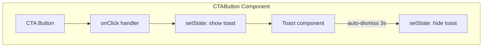

## Problem Statement

The primary CTA button on the event detail page ("View rate-sensitive assets", "View affected assets", etc.) is a `<button>` with no `onClick` handler or `href`. Clicking it does absolutely nothing — no navigation, no visual feedback, no toast. The spec says to "end with a clear CTA", but the current CTA is a dead end that undermines user trust.

## User Story

As a trader viewing an event detail, I want the CTA button to do something actionable (search for related assets, or at minimum show a clear indication it was acknowledged) so that the event analysis leads to a next step rather than a dead end.

## How It Was Found

Opened `/event/evt-001` in agent-browser, scrolled to the bottom, inspected the CTA button via snapshot. The button element `<button>View rate-sensitive assets</button>` has no handler. Clicking it in the browser produced no response. Screenshot evidence in `review-screenshots/07-event-detail-bottom.png`.

## Proposed UX

Since this is MVP and deep broker integration is a non-goal, the CTA should:
- On click, show a brief toast or inline message: "Coming soon — asset search launching shortly" or similar
- Alternatively, link to a relevant external search (e.g., Google Finance search for the affected asset names from the historical matches)
- The button should have visual feedback on click (pressed state, subtle animation)

Preferred approach: a lightweight toast notification that appears briefly confirming the action was registered, keeping the user on the page.

## Acceptance Criteria

- [ ] CTA button click triggers visible feedback (toast, inline message, or navigation)
- [ ] Button has proper hover and active states (visual press feedback)
- [ ] Feedback message is clear and non-misleading
- [ ] Works for all event types and their respective CTA texts
- [ ] No console errors on click

## Verification

- Click CTA on `/event/evt-001`, `/event/evt-003`, `/event/evt-005` — all should respond
- Screenshot showing toast/feedback after click

## Research Notes

- Current `CTAButton` is a `<button>` with no handler — purely visual
- The component is a server component (no `"use client"` directive) — needs to become a client component for interactivity
- Adding a lightweight toast is the best MVP approach — no external dependencies needed
- Can implement a simple CSS-animated toast that auto-dismisses after ~3 seconds
- The spec says "Always end with a clear action" — even a placeholder action is better than nothing
- Event type determines CTA text via the `CTA_TEXT` record — keep this mapping

## Architecture Diagram

## One-Week Decision

**YES** — Single component change, add client interactivity with a simple toast. Estimated 20 minutes.

## Implementation Plan

### Phase 1 — Convert CTAButton to client component
- Add `"use client"` directive
- Add state for toast visibility
- Add `onClick` handler that shows the toast

### Phase 2 — Inline toast UI
- Render a small toast banner below the button (or as a fixed-position element)
- Auto-dismiss after 3 seconds using `setTimeout`
- Animate with Tailwind (fade in/out)
- Message: "Coming soon" with context based on event type

## Out of Scope

- Actual broker integration or asset search functionality
- Persistent state or tracking of CTA clicks
