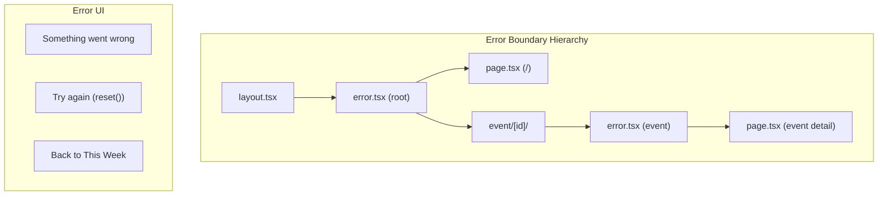

## Problem Statement

The app has no `error.tsx` at any route level. If a server-side or client-side rendering error occurs (e.g., a data fetch throws unexpectedly, a component crashes), there is no fallback UI. In development, users would see the Next.js error overlay; in production, they could see a blank page or the default Next.js error page with no branding and no recovery path.

## User Story

As a user, when something goes wrong in the app, I want to see a helpful error message with an option to retry or go home, rather than a blank screen or cryptic error message.

## How It Was Found

Inspected the project structure — no `error.tsx` files exist anywhere in `src/app/`. The app relies entirely on Next.js defaults for error recovery. Confirmed via `find` that no error boundary files exist. Combined with the 404 finding, this means ALL error states show raw, unbranded default pages.

## Proposed UX

- Add `src/app/error.tsx` (root-level error boundary) with:
  - Branded styling matching the app's editorial feel
  - Clear error message: "Something went wrong"
  - A "Try again" button that calls the `reset()` function
  - A "Back to This Week" link to go home
- Add `src/app/event/[id]/error.tsx` for event-specific errors with similar styling

## Acceptance Criteria

- [ ] `src/app/error.tsx` exists and is a client component (`"use client"`)
- [ ] Error boundary renders branded fallback UI with retry and home link
- [ ] `src/app/event/[id]/error.tsx` exists for event-specific errors
- [ ] Both error boundaries include `reset()` retry functionality
- [ ] Typography and styling match the editorial feel
- [ ] No console errors from the error boundaries themselves

## Verification

- Temporarily break a component to trigger the error boundary
- Verify the fallback UI renders with retry and home link
- Run `npm run build` to confirm no build errors

## Research Notes

- Next.js App Router `error.tsx` must be a client component (`"use client"`)
- It receives `error` and `reset` props from Next.js
- `error.tsx` catches errors from its child segments and the page component
- Root `error.tsx` catches errors for all routes except layout-level errors
- The `reset()` function re-renders the segment to attempt recovery
- Adding one at root level + one in the event route covers the main scenarios

## Architecture Diagram

## One-Week Decision

**YES** — Two small client components with minimal logic. Estimated 20 minutes.

## Implementation Plan

### Phase 1 — Root error boundary `src/app/error.tsx`
- `"use client"` directive
- Accept `error` and `reset` props
- Render branded error UI: heading, subtext, retry button, home link
- Match editorial styling (serif heading, muted body text)

### Phase 2 — Event error boundary `src/app/event/[id]/error.tsx`
- Same structure as root but with event-specific messaging
- "We couldn't load this event" + retry + home link

## Out of Scope

- Global error boundary (`global-error.tsx`) for root layout errors
- Error logging/reporting to external services
- Specific error messages per error type
