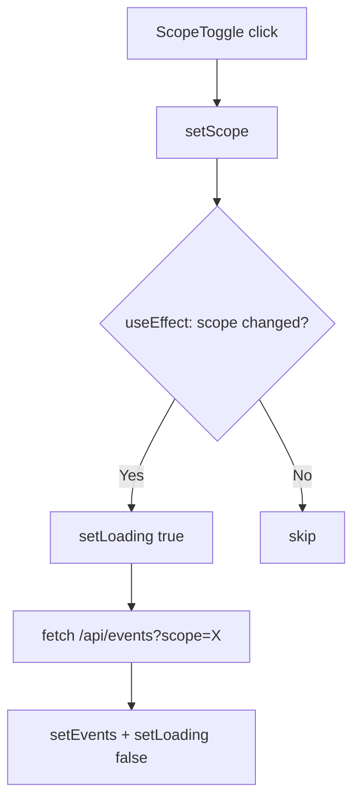

## Problem statement

The `WeeklyViewClient` component has `events` in the `useEffect` dependency array (line 89). When the user clicks the scope toggle (Global → UK/DE/FR), the following infinite loop occurs:

1. Scope changes → effect fires → fetches `/api/events?scope=local`
2. Fetch resolves → `setEvents(data.events)` creates a new array reference
3. `events` changed → effect fires again (it's in the dep array)
4. New fetch → new array → effect fires again → infinite loop

After one scope toggle, the page becomes permanently blank — even switching back to Global doesn't recover because `events !== initialEvents` (reference identity broken).

## User story

As a trader, I want to switch between Global and Local scopes without the page breaking, so that I can browse events by region.

## How it was found

Edge-case testing with `agent-browser`: clicked UK/DE/FR toggle, page went blank (no events, no skeletons, no error message). Toggled back to Global — still blank. Only a full page reload recovered.

## Proposed UX

- Toggling scope fetches new data, shows skeleton loader during fetch, then renders events.
- Toggling back to Global restores the original events instantly (no fetch needed if data is cached).
- No visual glitch, no blank state.

## Acceptance criteria

- [ ] Remove `events` from the `useEffect` dependency array — only depend on `scope`
- [ ] Toggling Global → Local → Global works without page going blank
- [ ] Loading skeleton shows during fetch, then events render
- [ ] No infinite network requests in browser DevTools when toggling scope
- [ ] Build passes (`npm run build`)

## Verification

Run all tests and verify in browser with agent-browser: toggle scope multiple times, confirm events render each time.

## Out of scope

- Making scope filtering work with real API data (separate concern)
- Adding empty state UI (separate task)

---

## Planning

### Overview

The `WeeklyViewClient` component has a React useEffect with `events` in its dependency array. Since `setEvents(data.events)` always produces a new array reference (from JSON.parse), every fetch triggers a re-render that triggers a re-fetch — an infinite loop. The fix is to remove `events` from the dependency array and restructure the initial-load optimization.

### Research notes

- React useEffect dependency arrays use `Object.is` comparison — new array refs always differ
- The `events === initialEvents` check on line 65 is a reference-identity optimization that breaks once events is ever replaced
- The fix pattern: depend only on `scope`, use a ref or conditional to handle the initial load case

### Assumptions

- The only trigger for re-fetching should be a scope change, not an events change
- Initial server-rendered events (global scope) should be used without a client-side fetch

### Architecture diagram

### One-week decision

**YES** — This is a single-file, ~10-line fix in `WeeklyViewClient.tsx`. Estimated: 15 minutes.

### Implementation plan

1. Remove `events` from the useEffect dependency array
2. Remove `initialEvents` from the dependency array
3. Change the early-return condition: skip the fetch when scope is "global" on first render using a ref or by checking if the component has already fetched
4. Verify: toggle scope multiple times, confirm no infinite requests
5. Run `npm run build` to confirm no issues
