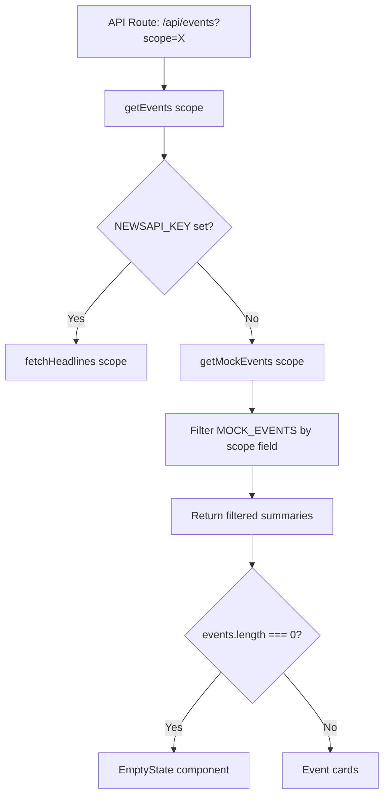

## Problem statement

Two related issues make the scope toggle meaningless:

1. **Mock data not filtered by scope:** `getMockEvents()` returns all 7 events regardless of scope. The API `/api/events?scope=local` returns the same events as `?scope=global`. Only `evt-006` (Deutsche Bank) has `scope: "local"` in mock data, but the function ignores this field.

2. **No empty state when events list is empty:** When the events array is empty (e.g., if scope filtering returns zero results, or API fails silently), the weekly view shows a completely blank area — no message, no illustration, no guidance.

## User story

As a trader using the Local scope, I want to see only regionally relevant events, so that I can focus on markets I care about. If no events are available, I want a clear message instead of a blank page.

## How it was found

- Tested API: `curl /api/events?scope=local` returned the same 7 global events.
- Read `mock-data.ts`: only `evt-006` has `scope: "local"`, but `getMockEvents()` doesn't filter.
- After fixing the infinite loop bug, the Local view would show all global events (wrong) or potentially empty (no messaging).

## Proposed UX

- **Local scope** shows only events with `scope: "local"` (for mock data). With a real API, the backend already calls `fetchHeadlines(scope, apiKey)` which handles it.
- **Empty state** for zero results: centered message like "No local events this week. Switch to Global for worldwide coverage." with a button/link to switch scope.
- The empty state should match the app's editorial design language.

## Acceptance criteria

- [ ] `getMockEvents()` accepts a `scope` parameter and filters events accordingly
- [ ] API route passes scope to `getEvents()` (already does) and mock fallback respects it
- [ ] When Local scope returns 0 events, the weekly view shows an empty state message
- [ ] Empty state includes a way to switch back to Global
- [ ] Build passes (`npm run build`)

## Verification

Run the app, toggle to Local, verify only local events appear. If none, verify the empty state renders.

## Out of scope

- Adding more local mock events (one is sufficient for MVP)
- Real news API scope filtering (already implemented in `news-client.ts`)

---

## Planning

### Overview

Two changes: (1) `getMockEvents()` must accept a scope param and filter `MOCK_EVENTS` by scope field, (2) `WeeklyViewClient` needs an empty-state component when the events array is empty.

### Research notes

- `MOCK_EVENTS` already has a `scope` field on each item (6 global, 1 local)
- `MarketEventSummary` doesn't include `scope` — filtering happens at the data layer
- `getMockEvents()` currently strips scope when mapping to summaries
- The empty state should match the editorial design language (serif headings, muted text, minimal)

### Assumptions

- One local mock event (evt-006 Deutsche Bank) is sufficient for MVP to demonstrate scope filtering works
- The empty state should offer a way to switch back to Global scope

### Architecture diagram

### One-week decision

**YES** — Two small changes across 2 files. Estimated: 30 minutes.

### Implementation plan

1. Update `getMockEvents(scope)` in `mock-data.ts` to accept optional scope param and filter
2. Update `getMockEventById()` if needed (it looks up by ID so no scope needed)
3. Add an `EmptyState` component inside `WeeklyViewClient.tsx` for zero-result case
4. The empty state includes a message and a link/button to switch to Global
5. Run `npm run build` to confirm no issues
