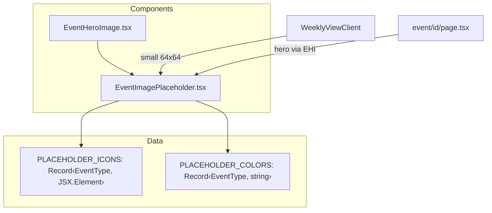

## Problem statement

Both the small card thumbnails (64x64 in weekly view) and the large hero placeholder (full-width, 192px tall on event detail) use a bare gradient with text at 30% opacity. This is the weakest visual element in an otherwise polished editorial design:

1. **Small card placeholders** — The text labels ("RATES", "EARNINGS", "RESTRUCTURING") are nearly invisible and "RESTRUCTURING" overflows the 64x64 box, clipping visually.
2. **Hero placeholder** — The full-width gradient block with tiny centered text looks like a broken image, not an intentional design choice. It dominates above the fold on the event detail page.

## User story

As a trader browsing events, I want image placeholders to look intentional and on-brand so that missing images don't make the app feel unfinished.

## How it was found

Visual inspection with agent-browser during visual-polish review. The screenshot at review-screenshots/10-landing-annotated.png shows "RESTRUCTURING" overflowing the small card placeholder. The screenshot at review-screenshots/11-event-detail-top.png shows the large empty hero gradient.

## Proposed UX

**Small card placeholders (64x64):**
- Replace text labels with a simple, centered SVG icon per event type (e.g., chart-line for earnings, briefcase for layoffs, gavel for legal, landmark for regulation, percent for rates, globe for geopolitical, flame for commodities).
- Keep the type-specific gradient background.
- Icon should be rendered at ~24px, subtle (foreground/20 opacity), no text.

**Hero placeholder (detail page):**
- Use a taller, more textured treatment: the type-specific gradient as background plus a larger version of the same icon (48-64px) centered.
- Add a subtle pattern or noise texture overlay to give it an editorial feel rather than flat color.
- The overall impression should be "designed placeholder" not "missing image."

## Acceptance criteria

- [ ] Small card placeholders show a type-specific SVG icon instead of text
- [ ] No text overflow on any event type (including "RESTRUCTURING" which was the overflow case)
- [ ] Hero placeholder on event detail page uses icon + subtle texture, not bare gradient with tiny text
- [ ] All 7 event types have distinct icons
- [ ] Placeholder colors remain consistent with existing type-based color scheme
- [ ] No layout shifts when switching between real images and placeholders

## Verification

Run all tests. Open the weekly view and event detail pages in agent-browser; screenshot both to confirm placeholders look polished and intentional.

## Overview

Replace the text-based gradient placeholders in `EventImagePlaceholder.tsx` (used by both the small card thumbnails and `EventHeroImage.tsx` hero) with type-specific inline SVG icons. The change is entirely within two existing components. No new dependencies required.

## Research notes

- All 7 event types are defined in `src/lib/types.ts` as `EventType`
- `EventImagePlaceholder` is used in two contexts: small (64x64, card thumbnails in `WeeklyViewClient`) and large (full-width 192px hero in `EventHeroImage`)
- The component accepts `type` and `className` props — the icon approach works with the same interface
- Simple inline SVG icons (stroke-based, ~24px viewBox) are the lightest approach — no icon library needed
- A CSS noise/grain texture can be added via a pseudo-element with an SVG filter for editorial feel on the hero

## Assumptions

- The 7 event type icons will be simple line-art SVGs embedded directly in the component
- No external icon library — keeps bundle size minimal
- The gradient backgrounds stay, icons are overlaid

## Architecture diagram

## One-week decision

**YES** — This is a straightforward component update touching 1-2 files. Scope is ~2-3 hours.

## Implementation plan

### Phase 1: Create type-specific SVG icons
- Define a `PLACEHOLDER_ICONS` map in `EventImagePlaceholder.tsx` returning inline SVG elements for each `EventType`
- Icons: chart-bar (earnings), scissors (layoffs), scale (legal), landmark (regulation), percent (rates), globe (geopolitical), flame (commodities)

### Phase 2: Update EventImagePlaceholder
- Replace the `` text element with the SVG icon
- Icon sizes: 24px for small placeholders, 48px for large (detect via className or a new `size` prop)
- Add a subtle noise texture overlay using a CSS pseudo-element or SVG filter for the hero variant

### Phase 3: Verify
- Run tests, build, verify in browser for both weekly view thumbnails and event detail hero

## Out of scope

- Sourcing real news images
- AI-generated images
- Animated placeholders
