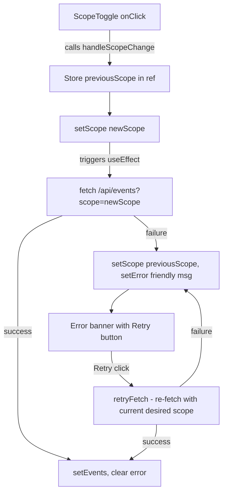

## Problem Statement

When the scope toggle triggers a fetch to `/api/events?scope=<value>` and the request fails (network error, server error, timeout), the UI enters a broken state:
- The scope toggle updates to the new position (e.g., "Global")
- But the events list still shows data from the previous scope (e.g., local events)
- The error banner displays the raw JavaScript error message (e.g., "Network error") with no retry affordance
- The user cannot recover without a full page refresh

## User Story

As a trader toggling between Global and Local scope, I want the toggle to revert if the fetch fails so that the displayed events always match the selected scope, and I want a retry button so I can try again without refreshing the page.

## How It Was Found

Simulated a network error by overriding `window.fetch` in the browser to reject `/api/events` calls, then toggled scope. Observed the toggle moved to "Global" while local events remained visible. The error banner showed raw "Network error" text with no retry option. Screenshot evidence: `review-screenshots/21-fetch-error.png`.

## Proposed UX

1. On fetch failure, revert the scope state back to its previous value so the toggle matches the displayed events
2. Replace the raw error message with a user-friendly message: "Could not load events. Please try again."
3. Add a "Retry" button inside the error banner that re-triggers the fetch
4. Auto-dismiss the error banner after a successful retry

## Acceptance Criteria

- [ ] When scope toggle fetch fails, the scope state reverts to the previous value
- [ ] The toggle button position matches the currently displayed events at all times
- [ ] Error banner shows "Could not load events. Please try again." (not raw error messages)
- [ ] Error banner includes a "Retry" button that re-triggers the scope fetch
- [ ] After a successful retry, the error banner disappears and events update
- [ ] Existing loading skeleton behavior is preserved during fetch

## Verification

Run the app, override fetch to reject /api/events, toggle scope, and verify the toggle reverts. Then restore fetch and click Retry to confirm it works. Take a screenshot as evidence.

## Out of Scope

- Automatic retry with exponential backoff
- Offline detection or network status indicators
- Error tracking/reporting to external services

---

## Planning

### Overview

Single-file change in `WeeklyViewClient.tsx`. The current `useEffect` that fires on scope change sets `scope` immediately via `setScope`, then fetches. On failure, the scope state has already diverged from the displayed events. The fix: track a `pendingScope` separately, only commit the scope change after a successful fetch, and add an inline retry mechanism to the error banner.

### Research Notes

- React state updates are batched but the `setScope` call happens in `handleScopeChange` before the `useEffect` fires the fetch. The effect depends on `[scope]` so changing scope triggers the fetch.
- The fix pattern: use a `useRef` to track the "desired scope" and only update the rendered `scope` state on success. On failure, the ref reverts.
- Alternative simpler approach: pass both `previousScope` and `newScope` into the effect; on error, call `setScope(previousScope)` to revert.

### Assumptions

- No other consumers of the `scope` state outside `WeeklyViewClient`
- The `ScopeToggle` component is a controlled component driven purely by the `scope` prop

### Architecture Diagram

### One-Week Decision

**YES** — This is a focused change in one component (`WeeklyViewClient.tsx`). Approximately 20 lines of logic changes + a small retry button in the error banner JSX. Easily completable in under a day.

### Implementation Plan

1. Add a `previousScope` ref in `WeeklyViewClient` to track the last successful scope
2. In the error handler of the fetch `useEffect`, call `setScope(previousScopeRef.current)` to revert
3. On success, update `previousScopeRef.current = scope`
4. Replace raw `err.message` in `setError` with the static string "Could not load events. Please try again."
5. Add a `retryFetch` callback that re-triggers the scope fetch
6. Add a "Retry" button to the error banner JSX that calls `retryFetch`
7. Verify in browser with simulated network failure
