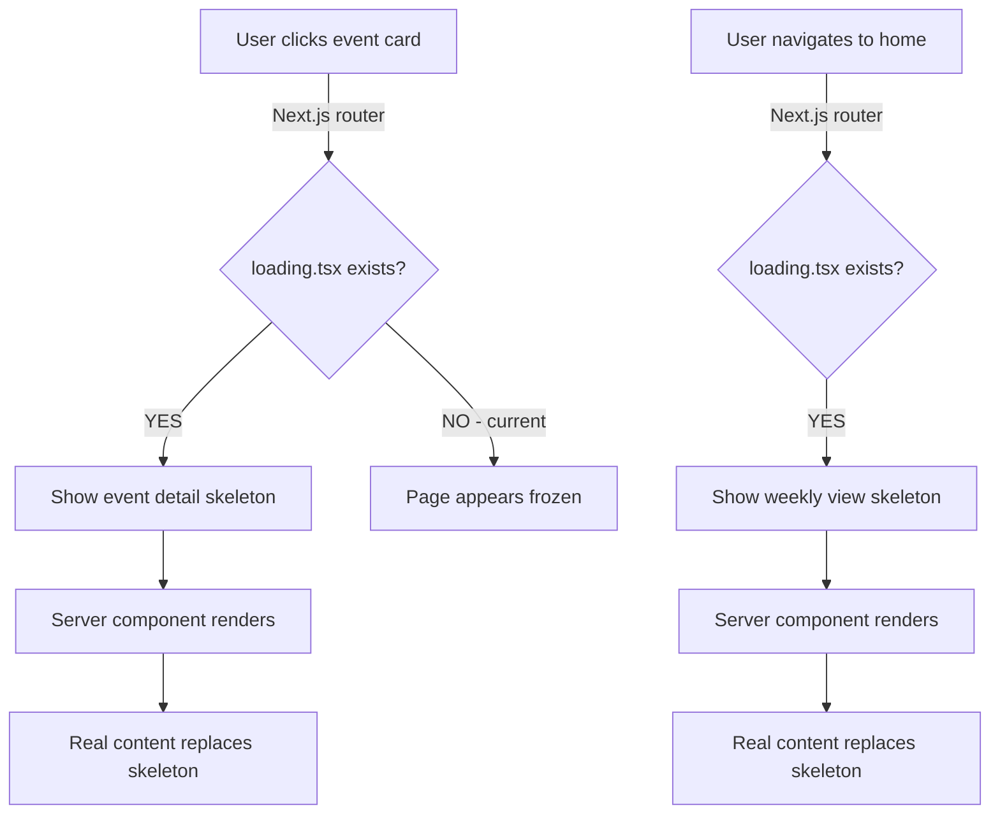

## Problem Statement

There are no `loading.tsx` files for any route segment. When navigating from the weekly view to an event detail page (which is a server component that may call the OpenAI API), users see zero visual feedback. The page appears frozen until the server response arrives. With slow networks or API latency, this can last several seconds.

## User Story

As a trader clicking on an event to see its historical analysis, I want to see a loading skeleton immediately so I know the app is responding and content is on its way.

## How It Was Found

Checked `src/app/` for `loading.tsx` files — none exist. Navigating between pages during browser testing showed no intermediate loading state. With mock data the delay is minimal, but with live APIs (NewsAPI + OpenAI) the event detail page can take 2-5 seconds to render with no feedback.

## Proposed UX

1. `src/app/loading.tsx` — Full-page skeleton matching the weekly view layout (date column + title + badge placeholders for 5 rows, matching the existing `EventCardSkeleton` style)
2. `src/app/event/[id]/loading.tsx` — Skeleton matching the event detail layout: hero image placeholder, title lines, badge, separator, "Similar Past Events" section with reaction table placeholder, and CTA button placeholder

Both skeletons should use the same `animate-pulse` pattern already established in `EventCardSkeleton` for visual consistency.

## Acceptance Criteria

- [ ] `src/app/loading.tsx` exists and shows a skeleton matching the weekly view structure
- [ ] `src/app/event/[id]/loading.tsx` exists and shows a skeleton matching the event detail structure
- [ ] Skeletons use the existing `animate-pulse` + `bg-foreground/5` pattern for consistency
- [ ] Skeletons appear instantly during page navigation (verified in browser)
- [ ] No layout shift when real content replaces the skeleton

## Verification

Navigate between the weekly view and event detail pages and verify skeletons appear during transitions. Take screenshots of both loading states.

## Out of Scope

- Streaming / Suspense boundaries within page components
- Progress bars or percentage indicators
- Prefetching or route preloading optimizations

---

## Planning

### Overview

Create two new `loading.tsx` files — one at the root app level and one in the event detail route segment. These are Next.js App Router conventions that automatically wrap page content in a `<Suspense>` boundary during navigation. The skeletons should mirror the actual page layouts to avoid layout shift.

### Research Notes

- Next.js `loading.tsx` automatically creates a Suspense boundary. The loading UI shows instantly during navigation while the server component renders.
- The existing `EventCardSkeleton` in `WeeklyViewClient.tsx` uses `animate-pulse` + `bg-foreground/5` — the new skeletons should match this pattern.
- The root `loading.tsx` should mirror the weekly view: header + scope toggle area + 5 card skeletons.
- The event detail `loading.tsx` should mirror: back link, hero image, title area, "Similar Past Events" section, CTA button.

### Assumptions

- The existing design tokens (`bg-foreground/5`, `bg-card`, `border-card-border`, `animate-pulse`) are sufficient.
- The existing `EventCardSkeleton` can be extracted and reused, or its pattern copied.

### Architecture Diagram

### One-Week Decision

**YES** — Two small skeleton component files with no logic, just JSX/CSS matching existing patterns. Completable in under 2 hours.

### Implementation Plan

1. Create `src/app/loading.tsx` with:
   - "This Week" heading placeholder
   - Scope toggle placeholder area
   - 5 card skeletons (reuse the `EventCardSkeleton` pattern from `WeeklyViewClient.tsx`)
2. Create `src/app/event/[id]/loading.tsx` with:
   - Back link placeholder
   - Hero image placeholder (matching `EventHeroImage` dimensions)
   - Badge + date placeholder
   - Title lines placeholder
   - Source placeholder
   - Summary lines placeholder
   - "Similar Past Events" section with reaction table skeleton
   - CTA button placeholder
3. Verify both skeletons appear during navigation in the browser
