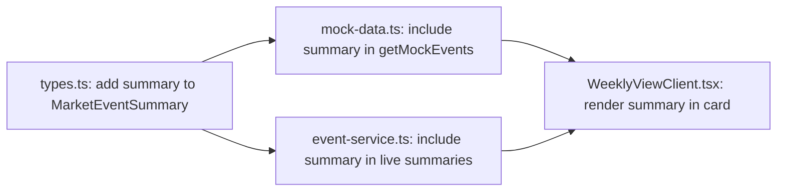

## Problem Statement

Weekly view event cards show only the headline, type badge, and source. Compared to competitors like CNBC — which show article snippets alongside headlines — our cards lack the context traders need to assess relevance at a glance. The `summary` field already exists in the data model (`MarketEvent.summary`) but is stripped out by `MarketEventSummary` and never reaches the weekly view. A trader must click into every event to know what it's about.

## User Story

As a trader scanning the weekly view, I want to see a brief summary under each headline so I can quickly assess which events are worth investigating without clicking into every detail page.

## How It Was Found

Side-by-side competitor comparison: CNBC shows article snippets in its news feed, giving readers immediate context. Our weekly view shows only "Fed Holds Rates Steady, Signals Cuts Later This Year / RATES / Reuters" — no indication of what the Fed actually signaled or why it matters. Screenshot evidence: `review-screenshots/33-weekly-view.png` vs `review-screenshots/42-cnbc-clean.png`.

## Proposed UX

1. Add a `summary` field to `MarketEventSummary` (already exists on `MarketEvent`)
2. Include `summary` in the `getMockEvents()` return value
3. Display a truncated summary (max ~120 characters) below the headline on each weekly view card, in a smaller muted text style
4. On mobile, truncate to ~80 characters to preserve compact layout
5. The summary should appear between the headline and the badge row

## Acceptance Criteria

- [ ] `MarketEventSummary` type includes `summary: string`
- [ ] `getMockEvents()` returns summary in each event object
- [ ] `/api/events` response includes summary for each event
- [ ] Weekly view cards show a truncated summary below the headline
- [ ] Summary text is styled smaller and muted (e.g., `text-xs text-muted`)
- [ ] Summary is truncated with ellipsis at ~120 characters on desktop
- [ ] Card layout remains clean and not cramped

## Verification

Open the weekly view and verify each card shows a brief summary. Compare visual density with CNBC screenshot. Navigate to event detail to confirm full summary still shows there.

## Out of Scope

- Expanding/collapsing summary on click
- Different summary lengths per event type
- AI-generated summary rewriting

---

## Planning

### Overview

Add the existing `summary` field from `MarketEvent` to `MarketEventSummary`, propagate it through the mock data helper and event service, and render a truncated preview in the weekly view cards.

### Research Notes

- `MarketEvent` already has `summary: string` with good content for all 7 events
- `MarketEventSummary` omits `summary` — it's stripped in `getMockEvents()` and `getEvents()`
- `WeeklyViewClient` receives `MarketEventSummary[]` — needs the field added
- The truncation can use a simple CSS `line-clamp-2` utility (Tailwind built-in) rather than JS truncation

### Assumptions

- The summary field is always populated (no need for null handling)
- 2-line clamp provides ~100-120 characters which is sufficient

### Architecture Diagram

### One-Week Decision

**YES** — Four small file changes, under 2 hours total. Add one field to a type, include it in two data paths, and render one new line in the card component.

### Implementation Plan

1. Update `MarketEventSummary` in `types.ts` to add `summary: string`
2. Update `getMockEvents()` in `mock-data.ts` to include `summary` in the return mapping
3. Update `getEvents()` in `event-service.ts` to include `summary` in live event summaries (line ~58)
4. Update `WeeklyViewClient.tsx` to render `event.summary` below the headline with `text-xs text-muted line-clamp-2`
5. Verify build passes and test in browser
