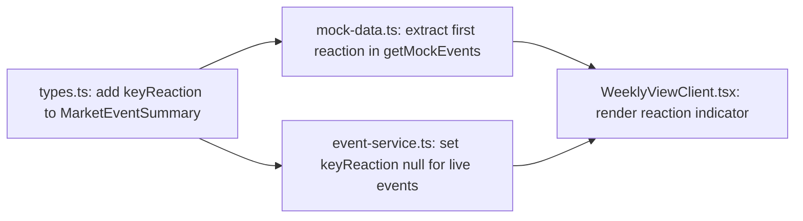

## Problem Statement

The weekly view cards show zero market data. The spec's core value proposition — "pairs it with similar historical events, shows how markets reacted" — is only visible after clicking into the detail page. Competitors like CNBC show market indices and direction arrows prominently on their main page. A trader scanning our weekly view cannot tell at a glance which direction markets moved for each event, making the cards feel like a basic news list rather than a decision-support tool.

## User Story

As a trader scanning the weekly view, I want to see the key market impact for each event directly on the card so I can immediately prioritize which events to investigate based on their market effect.

## How It Was Found

Side-by-side comparison with CNBC: CNBC shows a market indices ticker with direction arrows, percentages, and colored indicators on every page. Our weekly view cards contain no market data at all. The historical match reaction data exists in our backend (`MarketEvent.historicalMatches[0].reactions[0]`) but is never surfaced on the list view. Screenshot evidence: `review-screenshots/33-weekly-view.png` vs `review-screenshots/42-cnbc-clean.png`.

## Proposed UX

1. For each weekly view card, show the primary market reaction from the first historical match: the first asset name + direction arrow + Day 1 percentage
2. Display as a compact inline element in the card, positioned below the badge row or alongside it
3. Style: small text, green for "up" / red for "down", with a subtle arrow icon
4. Example rendering: "S&P 500 +1.1%" in green or "STOXX 600 Tech -1.4%" in red
5. To get this data to the card, add a `keyReaction` field to `MarketEventSummary`

## Acceptance Criteria

- [ ] `MarketEventSummary` type includes `keyReaction: { asset: string; direction: "up" | "down"; day1Pct: number } | null`
- [ ] `getMockEvents()` extracts the first reaction from the first historical match and includes it
- [ ] `/api/events` response includes `keyReaction` for each event
- [ ] Weekly view cards display the key reaction inline (asset + direction + percentage)
- [ ] Up reactions are green, down reactions are red
- [ ] Cards without historical matches show no reaction indicator (graceful null handling)
- [ ] Text is compact and does not overwhelm the card layout

## Verification

Open the weekly view and verify each card shows a market reaction indicator. Verify colors match direction. Click into event detail and confirm the shown reaction matches the first historical match's first reaction.

## Out of Scope

- Showing multiple reactions per card
- Live or real-time market data
- Sparkline charts on cards
- Week 1 performance on cards (keep it to Day 1 only for compactness)

---

## Planning

### Overview

Surface the primary market reaction from historical matches on each weekly card. Extract the first reaction of the first historical match and expose it as `keyReaction` on `MarketEventSummary`.

### Research Notes

- Each `MarketEvent.historicalMatches[0].reactions[0]` has `{ asset, direction, day1Pct, week1Pct }`
- For mock data, this is always available. For live events, historical matches are only fetched on the detail page (`getEventById`), so live summaries won't have `keyReaction` — it should be `null` for live events
- Tailwind has built-in green/red color utilities: `text-emerald-600` for up, `text-red-500` for down

### Assumptions

- All mock events have at least one historical match with at least one reaction
- Live events will show `null` for `keyReaction` until we add historical match caching at the list level

### Architecture Diagram

### One-Week Decision

**YES** — Same pattern as the summary task. Add type field, populate in data layer, render in card. Under 2 hours.

### Implementation Plan

1. Add `keyReaction: { asset: string; direction: "up" | "down"; day1Pct: number } | null` to `MarketEventSummary` in `types.ts`
2. Update `getMockEvents()` to extract `MOCK_EVENTS[i].historicalMatches[0]?.reactions[0]` and map to `keyReaction`
3. Update `getEvents()` to set `keyReaction: null` for live events
4. Update `WeeklyViewClient.tsx` to render the indicator below the badge row: small text with direction arrow + asset + percentage
5. Style: `text-emerald-600` for up, `text-red-500` for down, `text-[11px]` size
6. Verify build and test in browser
