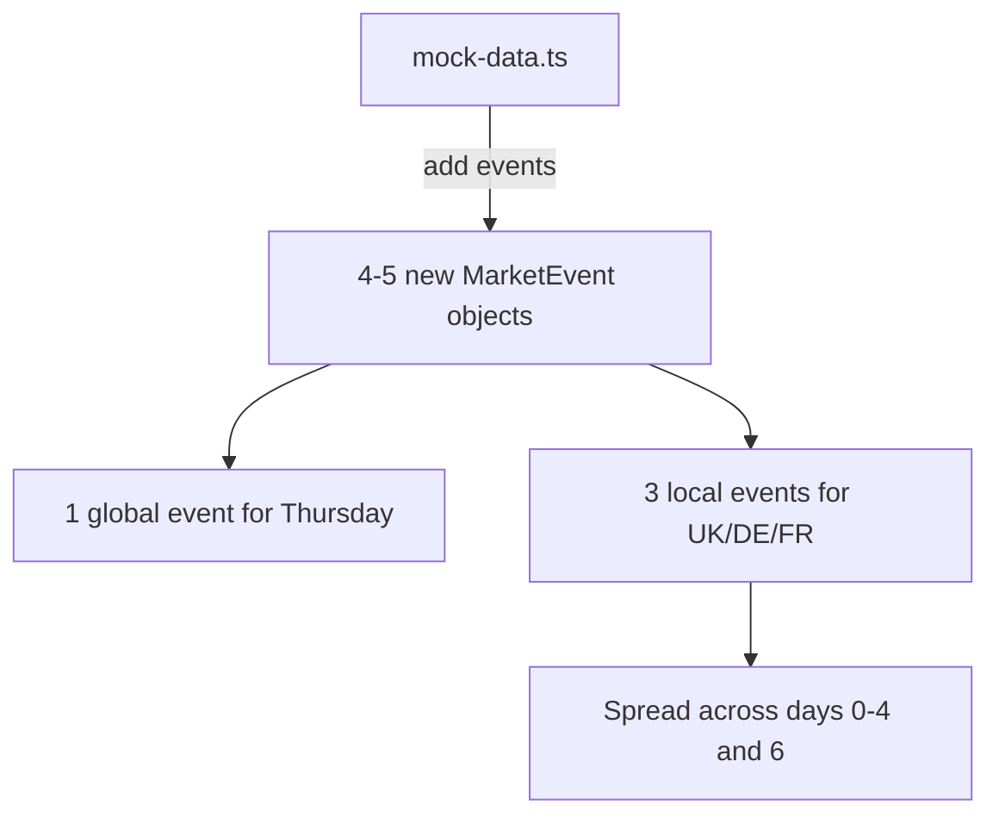

## Problem Statement

Two coverage issues in the mock data:

1. **Sparse local scope**: The local scope (UK/DE/FR) contains only 1 event (Deutsche Bank lawsuit on Thursday). The spec says "Local covers: UK, Germany, France" and "1 key event per day." Switching to Local shows a nearly empty page with one card and a huge blank area — it feels broken compared to the Global view's 6 events. Screenshot evidence: `review-screenshots/44-local-scope.png`.

2. **Missing global Thursday**: The Global view skips Thursday because the only event that day (Deutsche Bank) is local-scoped. The spec says "1 key event per day" but the global timeline has a gap, breaking the "This Week" promise.

## User Story

As a trader using the Local scope, I want to see multiple events covering UK, Germany, and France throughout the week so the feature feels valuable — not a dead-end with 1 lonely card.

As a trader scanning the Global view, I want every day of the week represented so there are no unexplained gaps in the timeline.

## How It Was Found

Browser testing: switched to "UK / DE / FR" scope and observed only 1 event displayed with vast empty space below. Also noticed the Global view jumps from Friday directly to Wednesday, skipping Thursday. Screenshot evidence: `review-screenshots/44-local-scope.png` and `review-screenshots/33-weekly-view.png`.

## Proposed UX

1. Add 3-4 local events to mock data covering different days and event types:
   - UK: e.g., Bank of England rate decision, FTSE-listed company earnings
   - Germany: e.g., Ifo business climate survey, automotive industry restructuring
   - France: e.g., CAC 40 company earnings, French regulatory action
2. Add 1 global event for Thursday (the missing day) so global has 7 events for the full week
3. Keep mock data quality high — realistic headlines, plausible historical matches with reactions

## Acceptance Criteria

- [ ] Local scope shows at least 4 events spanning different days of the week
- [ ] Local events include at least one each from UK, Germany, and France
- [ ] Global scope shows 7 events — one for every day of the current week
- [ ] Each new event has realistic historical matches with market reaction data
- [ ] Each new event has a proper summary, source, and event type
- [ ] No duplicate dates within the same scope

## Verification

Open the weekly view in Global scope and count 7 events (one per day). Switch to Local scope and verify at least 4 events appear. Click into each new local event to verify historical matches render correctly.

## Out of Scope

- Real API integration for local events
- Country-specific filtering within local scope
- More than 7 days of events

---

## Planning

### Overview

Expand `MOCK_EVENTS` in `mock-data.ts` with additional local events and one global event for the missing Thursday slot. Each new event needs a realistic title, summary, type, source, historicalMatches with reactions.

### Research Notes

- Current mock data has 7 events: 6 global (days 0-4 and day 6) + 1 local (day 5 = Thursday)
- Global is missing day 5 (Thursday) — need to add a global event for `getDateString(5)` OR make the Deutsche Bank event dual-scoped. Simpler: add a separate global event for Thursday.
- Local has only 1 event (evt-006, Deutsche Bank, day 5). Need 3 more local events spread across different days.
- Local events should represent UK, Germany, France as per spec.
- Event dates use `getDateString(daysAgo)` pattern.

### Assumptions

- Mock event IDs can follow the existing `evt-XXX` pattern
- Each local event needs 1-2 historical matches with realistic reactions
- UK sources: Financial Times, The Guardian, BBC; DE: Handelsblatt, Der Spiegel; FR: Les Echos, Le Figaro

### Architecture Diagram

### One-Week Decision

**YES** — Pure data entry in one file. No logic changes, no new components. Approximately 3 hours of writing realistic mock data.

### Implementation Plan

1. Add a global event for `getDateString(5)` (Thursday) — e.g., "US Tech Sector Faces Antitrust Probe" or similar
2. Add UK local event — e.g., "Bank of England Holds Rate at 4.5%, Flags Persistent Inflation" for `getDateString(1)` (Monday)
3. Add German local event — e.g., "Volkswagen Announces Major EV Plant Restructuring" for `getDateString(3)` (Saturday)
4. Add French local event — e.g., "TotalEnergies Posts Record Quarterly Profit" for `getDateString(0)` (Tuesday/today)
5. Each with realistic historical matches, reactions, sources
6. Verify both scopes render correctly in browser
