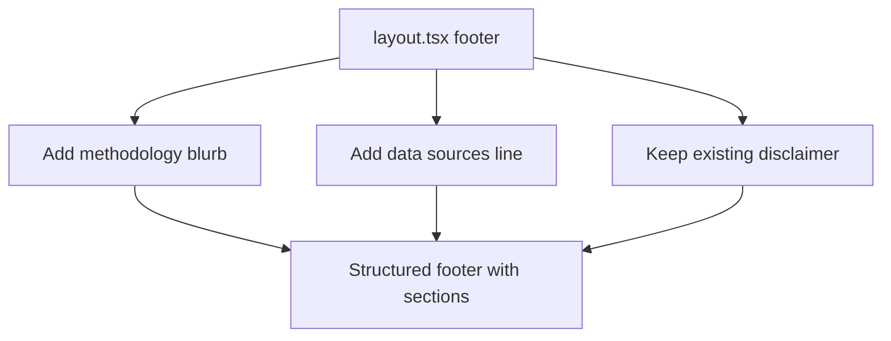

## Problem Statement

The app currently displays only a single-line disclaimer at the bottom: "Historical data is illustrative and based on publicly available records. Past performance does not indicate future results. This is not financial advice." While the disclaimer is necessary, it feels bare and reduces credibility. Competitors like CNBC have structured footers with navigation, about sections, and data source attribution. For a decision-support tool that traders rely on, a lack of provenance information undermines trust.

## User Story

As a trader evaluating whether to trust this tool's historical analysis, I want to see clear information about where the data comes from and how the historical matching works, so I can calibrate my confidence in the insights.

## How It Was Found

Side-by-side comparison with CNBC: CNBC has a professional footer with structured sections. Our app has a one-line disclaimer that looks like an afterthought. Screenshot evidence: `review-screenshots/35-event-detail-bottom.png`.

## Proposed UX

1. Replace the bare disclaimer text with a structured footer section at the bottom of every page
2. Footer should include:
   - A "How it works" blurb (1-2 sentences about the methodology: news aggregation → event detection → historical matching → market reaction analysis)
   - Data sources line: "News from Reuters, Bloomberg, Financial Times and others. Historical data from publicly available records."
   - The existing disclaimer text (kept as-is)
   - A subtle horizontal divider separating the footer from content
3. Style: muted text, smaller font size, generous padding, consistent with the editorial aesthetic
4. Apply to the root layout so it appears on all pages

## Acceptance Criteria

- [ ] Footer appears on all pages (weekly view and event detail)
- [ ] Footer includes a brief methodology description
- [ ] Footer includes data sources attribution
- [ ] Footer includes the existing disclaimer text
- [ ] Footer is visually separated from main content with a divider
- [ ] Footer text is styled muted and small to not distract from main content
- [ ] Footer is responsive and readable on narrow viewports

## Verification

Open the weekly view and scroll to the bottom to verify the footer renders. Navigate to an event detail page and verify the same footer appears. Check that the footer does not overlap or interfere with page content.

## Out of Scope

- Social media links
- Navigation links in footer
- Newsletter signup
- Cookie consent banner

---

## Planning

### Overview

Expand the existing `<footer>` in `layout.tsx` from a single disclaimer line to a structured section with methodology, data sources, and the disclaimer. No new components needed — it's a single-file change.

### Research Notes

- The current footer in `layout.tsx` (lines 60-68) already has the right container structure: `border-t`, `max-w-2xl`, etc.
- Just need to add more content above the existing disclaimer text
- Should maintain the same `text-[11px] text-muted` styling for consistency
- A subtle section divider between methodology/sources and disclaimer would help readability

### Assumptions

- The footer content is static (no dynamic data)
- The editorial tone should match the app's voice: professional, concise, trustworthy

### Architecture Diagram

### One-Week Decision

**YES** — Single-file change to `layout.tsx`. Expanding the footer JSX with 2 additional text blocks. Under 1 hour.

### Implementation Plan

1. Update the `<footer>` in `layout.tsx` to include:
   - "How it works" section: brief methodology explanation
   - "Sources" section: data source attribution
   - Existing disclaimer (preserved)
2. Add subtle visual hierarchy: small bold labels, consistent spacing
3. Verify footer renders on both weekly view and event detail pages
4. Ensure responsive layout on narrow viewports
