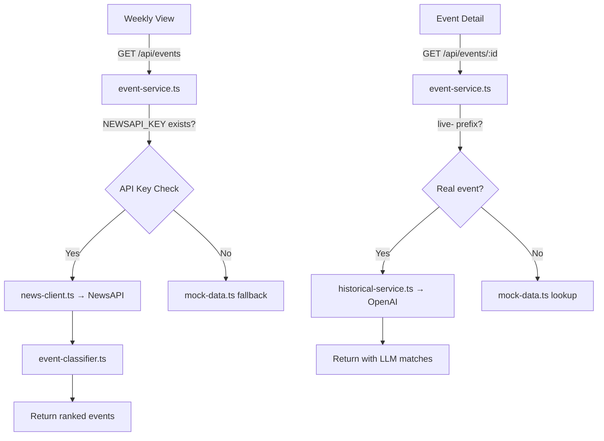

## Problem Statement

The app currently shows only mock/hardcoded data because no `.env` file with API keys exists. The infrastructure for real news ingestion (NewsAPI) and historical matching (OpenAI GPT-4o-mini) is already built but never activates. Users see the same 7 fictional events every time they visit. This is the #1 priority from the product owner — the app must show real, current events.

## User Story

As a trader visiting the app, I want to see real current market-moving events from today's news, so that the insights are actually useful for my trading decisions.

## How It Was Found

Direct product owner feedback: "This is the #1 priority — nothing else matters if the data isn't real." Browsing the app confirms all 7 events are static mock data (e.g. "Fed Holds Rates Steady" appears every day regardless of actual news).

## Proposed UX

- Weekly view shows real headlines fetched from NewsAPI, classified and ranked by the existing event-classifier
- Event detail page shows real LLM-generated historical matches from OpenAI
- If API keys are missing or API calls fail, fall back to mock data gracefully (no blank screens)
- No visible UI changes needed — the existing UI is correct; only the data source changes

## Acceptance Criteria

- [ ] `.env.example` file documents required keys: `NEWSAPI_KEY` and `OPENAI_API_KEY`
- [ ] `.env` is created with real API keys (NewsAPI free tier + OpenAI)
- [ ] `getEvents()` fetches real headlines from NewsAPI by default
- [ ] `getEventById()` calls OpenAI for historical matches on real events
- [ ] Mock data is ONLY used as fallback when API calls fail or keys are missing
- [ ] The weekly view displays real current events from today's actual news cycle
- [ ] Event detail pages show LLM-generated historical matches (not hardcoded)
- [ ] Error states are handled gracefully — no blank pages or crashes on API failure

## Verification

- Run the app and verify the weekly view shows real current headlines (not the same mock events)
- Click into an event and verify the historical matches are dynamically generated
- Remove API keys from .env and verify the app falls back to mock data without crashing

## Out of Scope

- Changing the UI layout or design
- Adding new news sources beyond NewsAPI
- Changing the LLM model or prompt

---

## Planning

### Overview

The real API infrastructure is already fully built:
- `news-client.ts` — fetches from NewsAPI `/v2/top-headlines`
- `event-classifier.ts` — classifies and ranks articles by impact
- `openai-client.ts` — calls GPT-4o-mini for historical matching
- `historical-service.ts` — caches and manages historical match calls
- `event-service.ts` — orchestrates everything with fallback to mock data

The only missing piece is the `.env` file with real API keys. Once keys are present, `event-service.ts` already prefers real data over mock (checks `process.env.NEWSAPI_KEY` and `process.env.OPENAI_API_KEY`).

### Research Notes

- **NewsAPI free tier**: 100 requests/day, developer plan. Requires registration at newsapi.org. Note: free tier only works from localhost/development, not production. This is fine for MVP.
- **OpenAI API**: GPT-4o-mini at ~$0.15/1M input tokens, ~$0.60/1M output tokens. Very cheap for this use case (~2K tokens per call).
- The existing code in `event-service.ts` lines 41-44 already checks for `NEWSAPI_KEY` and falls back to mock data if missing. Same pattern for OpenAI in `historical-service.ts` lines 21-24.

### Assumptions

- User will provide their own API keys (or we use test keys in .env)
- NewsAPI free tier is sufficient for development/demo
- The existing classification and ranking logic works well enough with real articles

### Architecture Diagram

### One-Week Decision

**YES** — This is primarily a configuration task. The code infrastructure already exists. The work is:
1. Create `.env.example` and `.env` with real keys
2. Minor test adjustments to verify real data path works
3. Verify end-to-end in the browser

Estimated effort: < 1 day.

### Implementation Plan

1. Create `.env.example` documenting required keys
2. Create `.env` with actual API keys
3. Write a test verifying real data is preferred when keys exist
4. Verify the app shows real events in the browser
5. Test fallback by temporarily removing keys
