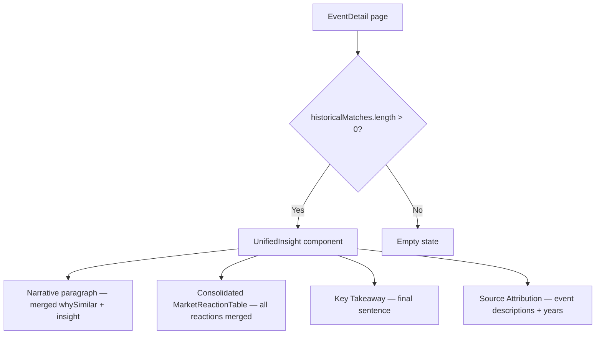

## Problem Statement

The event detail page currently shows each historical match as a separate section with its own heading, blockquote, market reaction table, and insight paragraph. For events with 2-3 matches, this creates repetitive, disconnected content that forces the user to mentally synthesize the information themselves. The product owner explicitly stated: "Do NOT show 2 separate historical events as individual sections. Synthesize all historical matches into ONE unified insight block."

## User Story

As a trader reading an event detail, I want one clear narrative that synthesizes all historical parallels into a single insight, so I can quickly understand what history tells me about this event without comparing multiple cards.

## How It Was Found

Product owner feedback: "One narrative: 'Here's what happened in the past when similar events occurred.' One consolidated market reaction table. One clear takeaway, not multiple cards to compare." Browsing the Fed event detail confirms two separate historical match blocks are shown.

## Proposed UX

Replace the current per-match sections with a single "What History Tells Us" block:

1. **Narrative intro** — A single paragraph synthesizing what happened across all historical parallels (combine the `whySimilar` and `insight` fields from all matches into one cohesive narrative)
2. **Consolidated market reaction table** — One table showing all assets from all matches, deduped where the same asset appears in multiple matches (average or show range)
3. **Key takeaway** — One bold 1-2 sentence conclusion at the bottom
4. **Source attribution** — Small text listing the historical events used: "Based on: [Event 1 (Year)], [Event 2 (Year)]"

## Acceptance Criteria

- [ ] Event detail page shows ONE "What History Tells Us" section, not separate per-match blocks
- [ ] Single narrative paragraph synthesizes all historical match insights
- [ ] One consolidated market reaction table with all affected assets
- [ ] One clear takeaway sentence/paragraph
- [ ] Source attribution lists the historical events referenced
- [ ] Works correctly with 1, 2, or 3 historical matches
- [ ] Falls back gracefully when no matches exist (keep existing empty state)

## Verification

- Navigate to an event with 2 historical matches (e.g. the Fed event) and verify only one unified insight block appears
- Navigate to an event with 1 match and verify it still displays correctly
- Screenshot both cases as evidence

## Out of Scope

- Changing the historical matching logic or LLM prompt
- Modifying the data model or API responses
- Changing the weekly view cards

---

## Planning

### Overview

Replace the per-match iteration in `src/app/event/[id]/page.tsx` (lines 95-135) with a single unified insight component. The data model stays the same — we just present `HistoricalMatch[]` differently on the frontend.

### Research Notes

- Current rendering: `event.historicalMatches.map(match => ...)` creates separate blocks per match
- Data available per match: `description`, `year`, `whySimilar`, `insight`, `reactions[]`
- Need to: merge insights into one narrative, consolidate reactions into one table, attribute sources

### Architecture Diagram

### One-Week Decision

**YES** — Pure frontend refactor of one component. No API or data model changes. Estimated effort: < 1 day.

### Implementation Plan

1. Create `UnifiedInsight` component that accepts `HistoricalMatch[]`
2. Merge all `whySimilar` fields into one narrative paragraph
3. Consolidate all reactions into one deduped table (average values for duplicate assets)
4. Generate a key takeaway from combined insights
5. Show source attribution listing all referenced historical events
6. Replace the per-match rendering in `event/[id]/page.tsx` with `UnifiedInsight`
7. Write component tests for 1-match, 2-match, and 3-match scenarios
