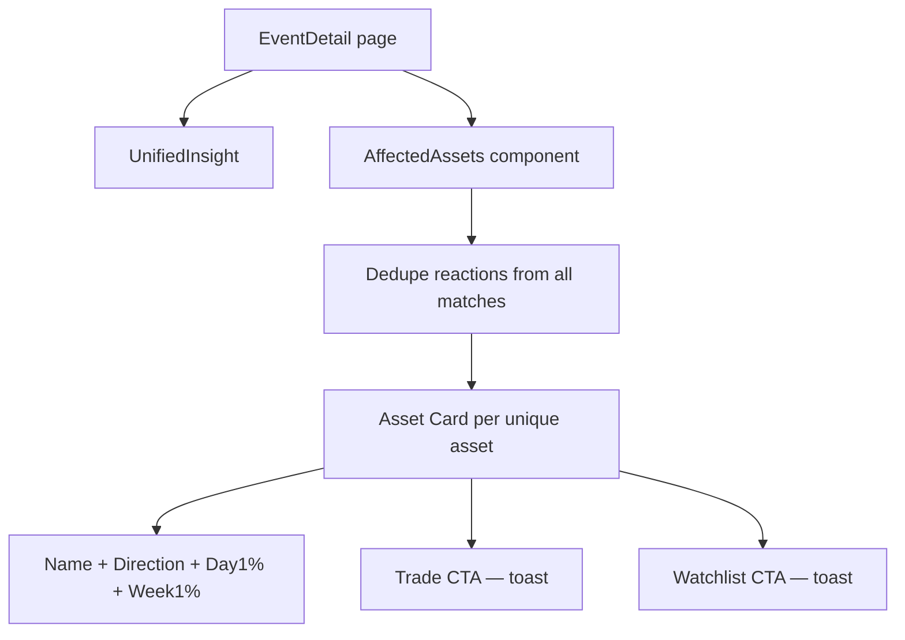

## Problem Statement

The event detail page's CTA button currently shows a toast saying "Coming soon — asset discovery is on the way." There is no way for a user to see which specific assets are affected by the event or take action on them. The product owner wants a clear "Affected Assets" section after the insight block, listing specific assets with direction hints and CTAs.

## User Story

As a trader reading an event detail, I want to see which specific assets (stocks, indices, commodities, currencies) are affected by this event and their expected direction, so I can quickly decide what to trade.

## How It Was Found

Product owner feedback: "After the insight, show a clear 'Affected Assets' section. List specific assets. Each asset: name, direction hint from history, historical performance data. CTAs ('Trade now', 'Add to watchlist') tied to specific assets, not generic."

## Proposed UX

After the unified insight block, add an "Affected Assets" section:

- Section heading: "Affected Assets"
- For each unique asset from the historical matches' reactions:
  - Asset name (e.g. "S&P 500", "Gold", "TSLA")
  - Direction indicator (up/down arrow with color)
  - Historical Day 1 and Week 1 performance (from the consolidated data)
  - Two small CTAs: "Trade" and "Watchlist" (show toast on click for now, since broker integration is out of scope)
- Replace the old generic bottom CTA with this section
- Clean, card-based layout — each asset gets its own row or card

## Acceptance Criteria

- [ ] "Affected Assets" section appears after the insight block on event detail
- [ ] Lists all unique assets from historical match reactions
- [ ] Each asset shows: name, direction (up/down), Day 1 %, Week 1 %
- [ ] Each asset has "Trade" and "Watchlist" CTA buttons
- [ ] CTAs show a toast on click (placeholder behavior, since broker integration is non-goal)
- [ ] Remove or replace the old generic bottom CTA button
- [ ] Works with 0 assets (graceful fallback — hide section)
- [ ] Responsive layout that works on mobile and desktop

## Verification

- Navigate to an event with multiple affected assets and verify the section renders correctly
- Click "Trade" and "Watchlist" CTAs and verify toast appears
- Verify responsive behavior at different viewport widths
- Screenshot as evidence

## Out of Scope

- Real broker integration or deeplinks
- Real-time price data for assets
- Search or filtering of assets

---

## Planning

### Overview

Add a new "Affected Assets" section below the unified insight block on the event detail page. Extract unique assets from the consolidated historical match reactions and display them as individual asset cards with direction hints, performance data, and per-asset CTAs.

### Research Notes

- Current CTA (`CTAButton.tsx`) is a generic button with a toast message — replace it with this section
- Reactions data is already available: `asset`, `direction`, `day1Pct`, `week1Pct`
- For deduplication when same asset appears in multiple matches: use average of the values
- CTAs are placeholder only (toast) — broker integration is explicitly out of scope

### Architecture Diagram

### One-Week Decision

**YES** — New frontend component + minor page layout change. No API or data model changes. Estimated effort: < 1 day.

### Implementation Plan

1. Create `AffectedAssets` component accepting `HistoricalMatch[]`
2. Extract and deduplicate all unique assets from all match reactions
3. Display each asset as a card with direction indicator, Day 1%, Week 1%
4. Add "Trade" and "Watchlist" buttons per asset (toast on click)
5. Replace the old generic `CTAButton` in `event/[id]/page.tsx`
6. Write component tests
7. Ensure responsive layout
