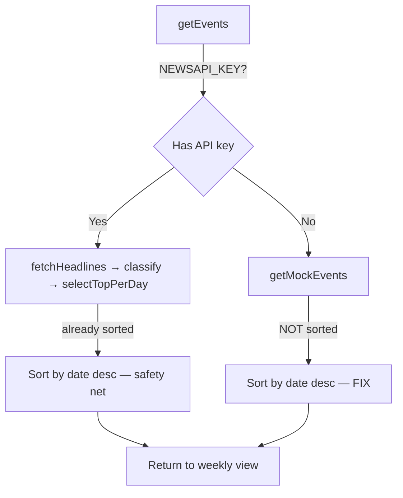

## Problem Statement

The weekly view displays events out of chronological order. Specifically, the global events list shows Wednesday Apr 8 (evt-007 / OPEC event) before Thursday Apr 9 (evt-008 / DOJ Antitrust event), because `getMockEvents()` returns events in array definition order without sorting by date. The `getEvents()` function in `event-service.ts` also doesn't sort its results before returning them. This means the weekly view's date ordering depends on the arbitrary order of the data source rather than being guaranteed chronologically correct.

## User Story

As a trader viewing the weekly events, I want events displayed in strict reverse-chronological order (newest first), so I can quickly find today's event and scan backward through the week without confusion.

## How It Was Found

While testing error handling scenarios by browsing the live app, I observed the event list on the home page shows: Tue 14 → Mon 13 → Sun 12 → Sat 11 → Fri 10 → Wed 8 → Thu 9. Wednesday appearing before Thursday is visually wrong and breaks the editorial, curated feel of the app.

## Proposed UX

Events should always appear in descending date order (newest first) in the weekly view, regardless of the order they arrive from the data layer. The sort should be applied at the service layer so both the API endpoint and the SSR page get correctly ordered data.

## Acceptance Criteria

- [ ] `getMockEvents()` returns events sorted by date descending
- [ ] `getEvents()` in `event-service.ts` sorts results by date descending before returning
- [ ] Weekly view always shows events in strict reverse-chronological order
- [ ] Both Global and Local scopes display events in correct date order
- [ ] API endpoint `/api/events` returns events sorted by date descending

## Verification

- View the weekly page and confirm events go from today backward without any ordering inconsistencies
- Check both Global and Local scopes
- Verify via `curl http://localhost:3050/api/events` that the JSON response has dates in descending order

## Out of Scope

- Changing the event detail page ordering
- Modifying the mock data array definition order
- Adding new events or changing existing event content

---

## Planning

### Overview

Add a date-descending sort to the two data paths that feed the weekly view: `getMockEvents()` in `mock-data.ts` and `getEvents()` in `event-service.ts`. This ensures events always display newest-first regardless of the underlying data order.

### Research Notes

- `getMockEvents()` (mock-data.ts line 494-516): filters by scope, maps to summaries, but never sorts. Events appear in array definition order.
- `getEvents()` (event-service.ts line 34-74): for the live data path, `selectTopEventPerDay()` already sorts by date descending (line 232-234 of event-classifier.ts). The bug only affects mock data (the fallback path on lines 43, 49, 72).
- The fix should be applied in both `getMockEvents()` and as a safety sort in `getEvents()` before returning, so both paths are guaranteed correct.

### Architecture Diagram

### One-Week Decision

**YES** — Two single-line sort additions. Estimated effort: < 30 minutes.

### Implementation Plan

1. Add `.sort()` by date descending in `getMockEvents()` after the `.map()` call
2. Add `.sort()` by date descending in `getEvents()` before returning results (safety net for both mock and live paths)
3. Verify via browser and API that events display in correct chronological order
