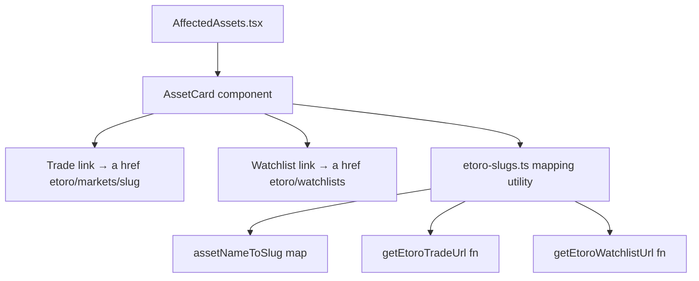

## Problem Statement

The Trade and Watchlist buttons in the Affected Assets section on the event detail page are dead ends. They show a "Coming soon" toast instead of linking users to eToro where they can actually act on the insight. The product owner explicitly requested these buttons deep-link to eToro.

## User Story

As a trader reading an event's historical analysis, I want the Trade and Watchlist buttons to take me directly to the relevant eToro page so I can act immediately on the insight without manually searching for the asset.

## How it was found

User feedback item #2 (highest priority). Confirmed via browser testing: clicking Trade or Watchlist on any affected asset shows a "Coming soon — Trading {asset} is not yet available" toast and goes nowhere.

## Proposed UX

- **Trade button** → opens `https://www.etoro.com/markets/{etoro-slug}` in a new tab
  - Map asset names to eToro slugs: S&P 500 → spx500, Gold → gold, Oil/Brent Crude → oil, Tesla/TSLA → tsla, 10Y Treasury → us10y, USD Index → usdollar, Alphabet (Google) → googl, BP → bp, STOXX 600 Tech → eustx50, FTSE 100 → uk100, CAC 40 → fchi, etc.
- **Watchlist button** → opens `https://www.etoro.com/watchlists` in a new tab
- Both buttons show "on eToro" label (small text or eToro logo mark)
- Buttons render as `<a>` tags with `target="_blank"` and `rel="noopener noreferrer"`
- Remove the old "Coming soon" toast logic
- Also remove the unused `CTAButton.tsx` component which is no longer referenced

## Acceptance Criteria

- [ ] Trade button opens `https://www.etoro.com/markets/{slug}` in a new tab
- [ ] Watchlist button opens `https://www.etoro.com/watchlists` in a new tab
- [ ] Asset name → eToro slug mapping covers all assets that appear in the app
- [ ] Buttons show "on eToro" label
- [ ] Buttons use `<a>` with `target="_blank"` and `rel="noopener noreferrer"`
- [ ] Old toast "Coming soon" logic removed from AffectedAssets.tsx
- [ ] Unused CTAButton.tsx component deleted
- [ ] Build passes, no console errors on event detail page

## Verification

- Run `npx next build` — no errors
- Open event detail page in browser, click Trade → eToro markets page opens in new tab
- Click Watchlist → eToro watchlists page opens in new tab
- Screenshot the affected assets section showing "on eToro" labels

## Planning

### Overview

Convert the Affected Assets CTA buttons from dead-end `<button>` elements with toast messages into proper `<a>` links that open eToro market pages in new tabs. Add an asset-name-to-eToro-slug mapping utility. Remove unused CTAButton component.

### Research Notes

- eToro market pages follow the pattern: `https://www.etoro.com/markets/{slug}`
- Common slug mappings: spx500 (S&P 500), gold, oil, tsla (Tesla), googl (Alphabet), bp, uk100 (FTSE 100)
- Watchlist URL: `https://www.etoro.com/watchlists`
- For unrecognized assets, fallback to `https://www.etoro.com/discover` search

### Architecture Diagram

### One-Week Decision

**YES** — This is a straightforward UI change: replace buttons with links, add a static mapping file, remove unused component. Estimated effort: ~2 hours.

### Implementation Plan

1. Create `src/lib/etoro-slugs.ts` with asset name → eToro slug mapping and URL helper functions
2. Refactor `AffectedAssets.tsx`: replace `<button>` with `<a>`, remove toast state/logic, add "on eToro" label
3. Delete `src/components/CTAButton.tsx` (unused)
4. Verify build passes and test in browser

## Out of scope

- eToro API integration or authenticated trading
- Portfolio tracking or position management
- Custom eToro widget embeds
