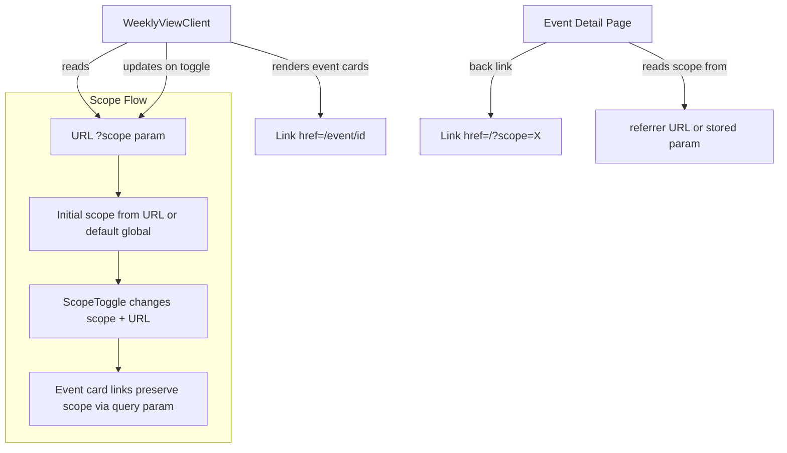

## Problem Statement

When a user switches to Local (UK/DE/FR) scope and clicks an event card, then uses the "This Week" back link to return, the scope resets to Global. This breaks the user journey for anyone exploring local events — they have to re-select Local every time they navigate back.

## User Story

As a user browsing local events, I want my scope selection to persist when I navigate to an event detail page and back so I don't have to re-select my scope every time.

## How it was found

Observed during ux-flows review: tested the "user explores local events" journey. Switched to UK/DE/FR, clicked a TotalEnergies event, clicked "This Week" to go back, scope was reset to Global with global events shown.

## Proposed UX

- Store the active scope in a URL search parameter (`?scope=local`) on the weekly view
- When the "This Week" back link on event detail pages is clicked, it navigates to `/?scope=local` if the user came from local scope
- On initial load, if `?scope=local` is in the URL, set scope to local and fetch local events
- The scope toggle updates the URL search param without a full page reload

## Acceptance Criteria

- [ ] Selecting Local scope adds `?scope=local` to the URL
- [ ] Selecting Global scope removes the `?scope` param (or sets `?scope=global`)
- [ ] Event detail page "This Week" back link preserves the scope param
- [ ] Navigating back from a local event returns to the local view
- [ ] Direct URL `/?scope=local` loads the local view on first visit
- [ ] Build passes

## Verification

- Switch to Local → click a local event → click "This Week" → should return to Local view
- Check URL shows `?scope=local` when local is selected
- Open `http://localhost:3050/?scope=local` directly — should show local events

## Planning

### Overview

Persist the scope selection (Global vs Local) via URL search params so navigating away from the weekly view and back doesn't lose the user's scope choice. The event detail page "This Week" link should include the scope param.

### Research Notes

- Next.js App Router supports `useSearchParams()` for reading URL params in client components
- `useRouter().replace()` can update URL without navigation/history push
- The event detail page "This Week" back link is a standard Next.js `<Link href="/">` that needs to conditionally include `?scope=local`
- The scope needs to flow from weekly view → event detail → back to weekly view
- Options: (a) URL search params on weekly view, (b) store scope in sessionStorage, (c) pass scope via link
- Best approach: URL search params — shareable, bookmark-friendly, no hidden state

### Architecture Diagram

### One-Week Decision

**YES** — Small client-side state management change. Estimated effort: ~2 hours.

### Implementation Plan

1. Update `WeeklyViewClient.tsx` to read initial scope from URL search params via `useSearchParams()`
2. Update scope toggle handler to also update URL with `window.history.replaceState`
3. Pass scope to event card links: `href={/event/${id}?from_scope=${scope}}`
4. Update event detail page "This Week" link to include `?scope=X` based on the `from_scope` query param
5. Wrap the page component in `<Suspense>` if needed for `useSearchParams()`

## Out of scope

- localStorage persistence across sessions
- Scope persistence on event detail page itself
