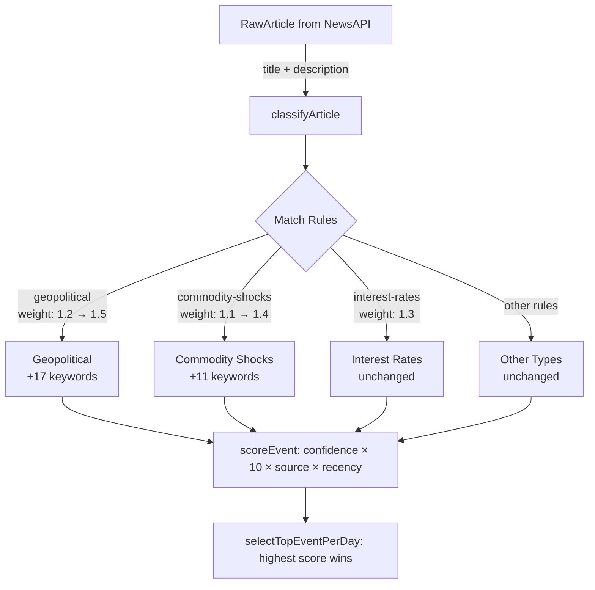

## Problem Statement

The event classifier's geopolitical and commodity-shocks keyword lists are too narrow to catch major market-moving events like the Hormuz Strait closure/blockade. The product owner reports that Trump's announcement about closing the Strait of Hormuz — an event affecting ~20% of global oil supply — would NOT be detected or would score lower than routine interest rate decisions.

Current issues:
- **Geopolitical keywords** (11 terms) miss: strait, hormuz, blockade, naval, shipping, maritime, choke point, gulf, persian, war, invasion, threat, attack, missile, drone, pipeline, suez, canal, border, nuclear, weapon, deploy, fleet, carrier, closure, occupation, annex
- **Commodity-shocks keywords** (11 terms) miss: shipping lane, route, disruption, supply disruption, refinery, barrel, bpd, production cut, output, fuel, energy crisis, price surge, supply shock
- **Geopolitical weight** is only 1.2 — same as regulation. Events like Hormuz/Suez closures can move oil 10%+ in a day and should have the highest weight
- **Commodity-shocks weight** is only 1.1 — lower than regulation (1.2) and interest-rates (1.3), despite commodity shocks often being the most immediately market-moving events

## User Story

As a trader using this app, I want geopolitical events like strait closures, blockades, and military actions to be detected and ranked as the #1 daily event, so that I see the most market-moving event rather than a routine rate hold.

## How It Was Found

Direct product owner feedback citing Trump's Hormuz Strait announcement as a test case the app would fail.

## Proposed UX

No visible UI changes — this is a backend classifier improvement. The result is that when real data is active, geopolitical/commodity events of this magnitude will rank above routine events and appear as the top daily event.

## Acceptance Criteria

- [ ] Geopolitical keywords include at least: strait, hormuz, blockade, naval, shipping, maritime, war, invasion, attack, missile, drone, nuclear, suez, gulf, border, closure, occupation
- [ ] Commodity-shocks keywords include at least: shipping lane, route, disruption, supply disruption, refinery, barrel, bpd, production cut, fuel, energy crisis, supply shock
- [ ] Geopolitical weight is raised to at least 1.5 (highest tier)
- [ ] Commodity-shocks weight is raised to at least 1.4
- [ ] A test verifies that an article about "Hormuz Strait blockade" classifies as geopolitical with high confidence
- [ ] A test verifies that a geopolitical article scores higher than a routine interest-rate article from the same source and time

## Verification

- Run classifier tests and confirm they pass
- Verify a mock "Hormuz Strait" headline classifies as geopolitical with top score

## Out of Scope

- Changing the UI or event display format
- Adding new event types
- Modifying the LLM prompt

## Research Notes

- Current `event-classifier.ts` has 7 classification rules with keyword-match scoring
- Geopolitical keywords (11 terms): sanctions, tariff, trade war, embargo, export control, conflict, geopolitical, summit, diplomatic, nato, military — weight 1.2
- Commodity-shocks keywords (11 terms): oil price, crude, opec, commodity, gold price, rare earth, supply chain, shortage, natural gas, wheat, copper — weight 1.1
- Interest-rates has the highest weight at 1.3; regulation also at 1.2
- The scoring formula: `(matchCount / totalKeywords) * weight` — so more keywords actually REDUCE per-keyword contribution unless more also match. Need to ensure common geopolitical phrasing hits multiple keywords to boost score.
- A Hormuz Strait headline like "Trump threatens to close Strait of Hormuz oil trade route" would currently match: zero geopolitical keywords (no exact matches for strait, hormuz, close, route, threat), zero commodity keywords (no exact match). This is a critical detection failure.

## Assumptions

- Adding more keywords won't cause false-positive issues for routine news because the threshold (0.05 confidence) combined with multi-keyword matching is already selective
- The scoring formula doesn't need structural changes — only keyword expansion and weight rebalancing

## Architecture Diagram

## One-Week Decision

**YES** — Single file change (event-classifier.ts) plus one new test file. No architectural changes. Estimated 1-2 hours.

## Implementation Plan

### Phase 1: Expand geopolitical keywords
Add 17+ keywords to the geopolitical rule: strait, hormuz, blockade, naval, shipping, maritime, war, invasion, attack, missile, drone, nuclear, suez, gulf, border, closure, occupation, annex, fleet, carrier, threat, deploy

### Phase 2: Expand commodity-shocks keywords
Add 11+ keywords: shipping lane, route, disruption, supply disruption, refinery, barrel, bpd, production cut, fuel, energy crisis, supply shock, pipeline

### Phase 3: Raise weights
- Geopolitical: 1.2 → 1.5 (highest — these events move multiple asset classes simultaneously)
- Commodity-shocks: 1.1 → 1.4 (second-highest — direct price impact)

### Phase 4: Add classifier tests
- Test that "Hormuz Strait blockade" headline classifies as geopolitical
- Test that geopolitical article with high-authority source outscores routine interest-rate article
- Test that "oil supply disruption" headline classifies as commodity-shocks
