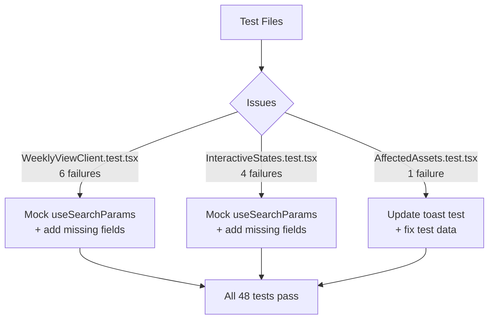

## Problem Statement

11 tests across 3 test files are failing due to component changes introduced in previous tasks (scope persistence, eToro CTA links, interactive states). The test suite has 37 passing and 11 failing tests.

Failing test files:
1. **WeeklyViewClient.test.tsx** (6 failures) — All tests crash with `Cannot read properties of null (reading 'get')` because `useSearchParams()` returns null. The component was updated to read scope from URL params (task: persist-scope-on-navigation) but the test mock doesn't wrap in Suspense or provide searchParams.
2. **AffectedAssets.test.tsx** (1 failure) — "shows a toast when Trade button is clicked" expects a "Coming soon" toast, but Trade buttons now link directly to eToro (task: add-etoro-cta-links).
3. **InteractiveStates.test.tsx** (4 failures) — Tests reference class names and component structure that no longer match the current implementation.

## User Story

As a developer working on this project, I want all tests to pass so that regressions are caught early and the test suite provides reliable quality signals.

## How It Was Found

Running `npx vitest run` during the product review: 3 failed test files, 11 failed tests, 37 passed.

## Proposed UX

No UI changes — test-only fixes.

## Acceptance Criteria

- [ ] WeeklyViewClient tests mock `useSearchParams` correctly (return a URLSearchParams instance, not null)
- [ ] AffectedAssets toast test is updated to reflect eToro link behavior (Trade buttons now navigate to eToro)
- [ ] InteractiveStates tests are updated to match current component class names and structure
- [ ] All 48 tests pass with `npx vitest run`
- [ ] No new test regressions introduced

## Verification

- Run `npx vitest run` and confirm 48/48 tests pass (0 failures)

## Out of Scope

- Adding new test coverage
- Changing component behavior
- Performance improvements

## Research Notes

### WeeklyViewClient.test.tsx (6 failures)
- Component uses `useSearchParams()` from `next/navigation` (line 52) which returns null in test env
- Fix: Mock `next/navigation` to provide a `useSearchParams` that returns a `URLSearchParams` instance
- Both WeeklyViewClient.test.tsx and InteractiveStates.test.tsx render WeeklyViewClient and need this mock
- The mock events in tests are missing the `summary` and `keyReaction` fields added to MarketEventSummary (keyReaction was added in task 0017)

### AffectedAssets.test.tsx (1 failure)
- Test "shows a toast when Trade button is clicked" expects `screen.getByText(/Coming soon/)` — but Trade buttons are now `<a>` tags linking to eToro (changed in task 0024)
- Test data includes "10Y Treasury" which is non-tradeable and gets filtered out. Need to update test data to use only eToro-tradeable assets.
- Fix: Replace toast test with a test verifying Trade button links to correct eToro URL. Update test data.

### InteractiveStates.test.tsx (4 failures)
- Same `useSearchParams()` null crash as WeeklyViewClient tests
- Tests check for CSS class names like `hover:shadow-md`, `hover:-translate-y-0.5`, `card-enter` — these still exist in the component, so once the mock is fixed these should pass
- Missing `summary` and `keyReaction` fields in mock event data

## Assumptions

- The component behavior is correct; only the test setup needs updating
- All test files use vitest + @testing-library/react
- After fixing, the existing 37 passing tests should continue to pass

## Architecture Diagram

## One-Week Decision

**YES** — Pure test-fix work touching 3 files. No new features, no architecture. Estimated 1-2 hours.

## Implementation Plan

### Phase 1: Add useSearchParams mock
Add `vi.mock("next/navigation", ...)` to both WeeklyViewClient.test.tsx and InteractiveStates.test.tsx, returning a URLSearchParams instance from `useSearchParams`.

### Phase 2: Fix mock event data
Add missing `summary` and `keyReaction` fields to mock event objects in all three test files so they match the current MarketEventSummary interface.

### Phase 3: Fix AffectedAssets toast test
- Replace "10Y Treasury" with an eToro-tradeable asset in test data
- Replace the toast assertion with a test verifying Trade button has correct eToro href
- Verify button count matches after filtering

### Phase 4: Run full test suite
Verify all 48 tests pass with `npx vitest run`
