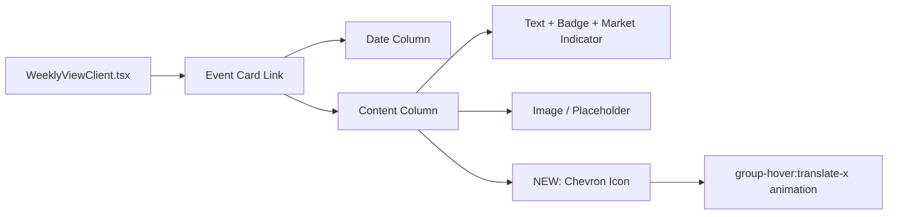

## Problem Statement

Event cards on the weekly view are clickable links that lead to detailed historical analysis (the core value proposition), but there is zero visual affordance indicating they are interactive. No arrow, chevron, "Read more" text, or any cue beyond a hover shadow (invisible on mobile/touch). A first-time user may browse the weekly view, see a list of news headlines, and leave — never discovering the historical matching feature that makes this app unique.

## User Story

As a first-time user landing on Trade the Past, I want to immediately understand that each event card leads to deeper historical analysis, so that I can discover the app's core value within my first visit.

## How It Was Found

Fresh-eyes review: opened the app as a new user. The cards look like static informational blocks. The only interaction hint is a subtle hover shadow/translate effect that requires mousing over on desktop and is completely absent on touch devices. The accessibility tree confirms the cards are links, but there is no visible affordance in the static rendered state.

## Proposed UX

- Add a small right-pointing chevron (→ or ›) at the right edge of each card, visible at all times (not just on hover)
- The chevron should be subtle (text-muted) and animate slightly on card hover (translate-x)
- On today's card, optionally add a short text like "See historical parallels" near the market indicator to make the value proposition explicit for the most prominent card
- Keep the overall editorial aesthetic — no bright buttons, just a quiet but clear affordance

## Acceptance Criteria

- [ ] Each event card displays a visible chevron/arrow indicator at rest (not only on hover)
- [ ] The chevron animates on hover (slight translate-x movement)
- [ ] Visual is subtle enough to maintain editorial aesthetic
- [ ] Works on touch devices (affordance visible without hover)
- [ ] Existing tests pass

## Verification

Run all tests, then visually verify in browser with agent-browser (screenshot).

## Out of Scope

- Changing the card layout or content structure
- Adding tooltips or onboarding modals

---

## Planning

### Overview

Add a subtle right-pointing chevron to each event card in `WeeklyViewClient.tsx`. The chevron should be visible at rest and animate on hover. This is a single-component change in the card's JSX.

### Research Notes

- The card is a `<Link>` wrapping a flex layout in `WeeklyViewClient.tsx` lines 173-245
- The card has an outer flex with a date column and content column
- There's room to add a chevron as a self-centering flex item at the right edge of the content area
- The existing hover state uses `hover:-translate-y-0.5` and `hover:shadow-md`
- Tailwind `group-hover:translate-x-0.5` can animate the chevron on card hover (already uses `group` class)

### Assumptions

- No additional dependencies needed — inline SVG chevron
- The chevron is decorative (the entire card is already a link)

### Architecture Diagram

### One-Week Decision

**YES** — This is a ~15-minute change to a single component. Add one SVG element with Tailwind classes.

### Implementation Plan

1. In `WeeklyViewClient.tsx`, add a chevron SVG as the last child inside the card's content flex container
2. Style it with `text-muted shrink-0 self-center` for positioning
3. Add `group-hover:translate-x-0.5 transition-transform` for hover animation
4. Verify existing tests pass
5. Screenshot to verify visual result
