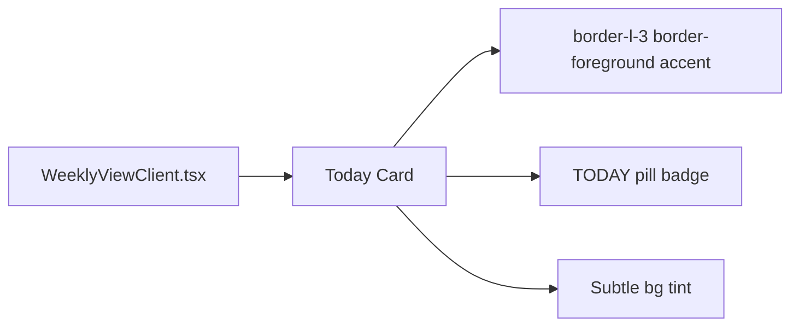

## Problem Statement

The spec says "one major market-moving event per day" is the focal point, but today's card barely differs from the other six. It has a slightly darker border (border-foreground/15 vs border-card-border) and a tiny "TODAY" label in 10px text. A first-time user scanning the page sees seven roughly identical cards and doesn't know which is most important or where to start.

## User Story

As a first-time visitor, I want today's event to clearly stand out from the rest of the week, so that I immediately know which event is most current and actionable.

## How It Was Found

Fresh-eyes browser review. Compared today's card (Tue 14 Apr — Fed Holds Rates Steady) to other cards. The visual difference is near-imperceptible: same background, same card style, only a subtle border shade change and a tiny "TODAY" label that blends into the date column.

## Proposed UX

- Give today's card a slightly different background (e.g. a very light warm tint, or a left accent border)
- Make the "TODAY" badge more visible — slightly larger, perhaps as a small pill/tag instead of ghost text
- Add a subtle left border accent (2-3px solid foreground) to today's card as a visual anchor
- Keep the difference tasteful — editorial, not flashy. Think of how The Economist or FT highlight the lead story.

## Acceptance Criteria

- [ ] Today's card has a visible left accent border or background tint that differentiates it from other cards
- [ ] The "TODAY" label is visually prominent (larger or styled as a pill badge)
- [ ] The difference is clear at a glance but maintains editorial aesthetic
- [ ] Non-today cards are unchanged
- [ ] Existing tests pass

## Verification

Run all tests, then visually verify in browser with agent-browser (screenshot).

## Out of Scope

- Changing the card content or data
- Adding animations or motion to today's card beyond existing hover

---

## Planning

### Overview

Enhance the visual differentiation of today's event card in `WeeklyViewClient.tsx`. Currently it uses a slightly different border (`border-foreground/15`) and a tiny "TODAY" label in 10px text — insufficient for first-time users to notice.

### Research Notes

- Today's card conditional styling is at line 177-181 in `WeeklyViewClient.tsx`
- The "TODAY" label is at line 199-202 — `text-[10px] font-semibold tracking-widest uppercase text-foreground/40`
- The card already has the `group` class for hover effects
- CSS variables are defined in `globals.css` for the color palette
- Adding a left border accent is a common editorial pattern (FT, Economist)

### Assumptions

- Using a 3px left border accent in foreground color for the lead story treatment
- Making the TODAY label a small pill badge rather than ghost text

### Architecture Diagram

### One-Week Decision

**YES** — Two CSS class changes to one component. ~20 minutes of work.

### Implementation Plan

1. Add `border-l-[3px] border-l-foreground` to today's card className
2. Style the "TODAY" label as a small pill: `text-[10px] font-semibold tracking-wider uppercase bg-foreground text-background px-1.5 py-0.5 rounded-sm inline-block`
3. Verify existing tests pass
4. Screenshot to verify visual result
