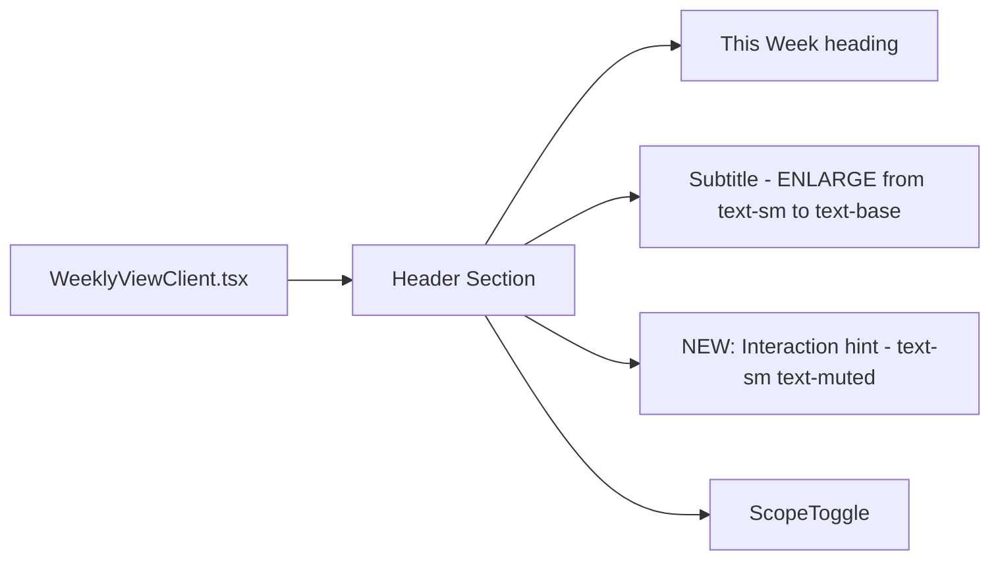

## Problem Statement

A first-time user landing on the app sees a heading ("This Week"), a tiny subtitle ("One market-moving event per day, paired with history" in text-sm text-muted), and a list of event cards. The "How it Works" section that explains the unique value proposition (historical pattern matching, market reaction data) is buried in the footer below all 7 event cards. Within a 10-second first impression, the app looks like yet another financial news feed — the thing the spec explicitly says to avoid ("Editorial feel, not a news aggregator").

## User Story

As a first-time visitor, I want to understand within 10 seconds what makes Trade the Past different from a regular news feed, so that I'm motivated to click an event and explore the historical analysis.

## How It Was Found

Fresh-eyes browser review. Loaded the page and tried to answer: "What is this app?" within 10 seconds. The subtitle helps but is too small (11px muted text). The actual methodology explanation is invisible above the fold — you must scroll past 7 full event cards to reach the footer's "How it Works" paragraph.

## Proposed UX

- Make the subtitle more prominent — bump it from text-sm text-muted to a readable secondary heading. It should be the second thing you read after "This Week".
- Optionally add a one-liner below the subtitle that hints at the core mechanic, e.g., "Click any event to see how markets reacted to similar events in the past" — something that makes the clickable nature of cards AND the historical matching both clear in one sentence.
- Keep it to 1-2 lines max. No onboarding flow, no modal, no tutorial. Just clearer copy above the fold.

## Acceptance Criteria

- [ ] The subtitle/tagline is visually larger and more prominent (not text-sm text-muted)
- [ ] A short hint explaining the card interaction + historical value is visible above the event list
- [ ] No more than 2 lines of text total — concise, not verbose
- [ ] Does not add onboarding modals, tooltips, or splash screens
- [ ] Maintains the editorial aesthetic
- [ ] Existing tests pass

## Verification

Run all tests, then visually verify in browser with agent-browser (screenshot).

## Out of Scope

- Adding a tutorial or onboarding flow
- Removing or changing the footer "How it Works" section
- Changing the scope toggle behavior

---

## Planning

### Overview

Make the subtitle/tagline in `WeeklyViewClient.tsx` more prominent and add a short hint about the card interaction model. Currently the subtitle is `text-sm text-muted` (small, grey) — easy to miss on first visit.

### Research Notes

- The subtitle is at line 138-140 in `WeeklyViewClient.tsx`: `
`
- The heading area is a flex container with "This Week" on the left and ScopeToggle on the right (lines 133-143)
- Adding a second line of text below the subtitle is safe — the ScopeToggle is `items-end` aligned
- Keep copy concise per the spec's "no noisy feeds" principle

### Assumptions

- A single sentence hint is enough — no modals, tooltips, or tutorials
- The hint should mention both "historical events" and "click" to set expectations

### Architecture Diagram

### One-Week Decision

**YES** — Change 2-3 CSS classes and add one line of text. ~10 minutes of work.

### Implementation Plan

1. In `WeeklyViewClient.tsx`, increase the subtitle from `text-sm text-muted` to `text-[15px] text-foreground/70` for better visibility
2. Add a second line below: `
Select an event to see how markets reacted to similar moments in the past.
`
3. Verify existing tests pass
4. Screenshot to verify visual result
