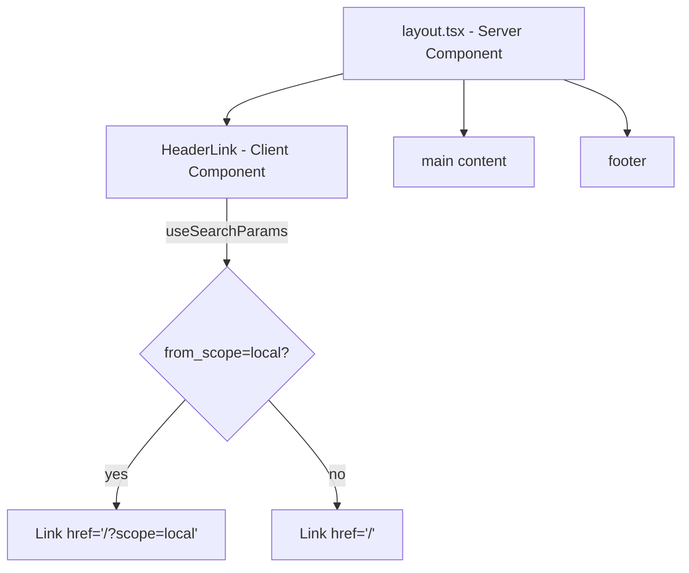

## Problem Statement

When a user browsing local-scope events navigates to an event detail page, the "Trade the Past" header logo link always points to `/` (global scope), while only the explicit "< This Week" back link preserves the scope via `/?scope=local`. Clicking the header logo — a common navigation pattern — silently resets the user to Global scope, losing their selection.

This is inconsistent: two navigation paths back to the weekly view (header logo vs. back link) produce different scope outcomes.

## User Story

As a user browsing UK / DE / FR local events, I want the header logo to return me to the weekly view with my scope selection preserved, so that I don't lose context when navigating via the brand link.

## How It Was Found

Edge-case testing in the browser:
1. Navigated to `/?scope=local` — saw local events.
2. Clicked a local event (TotalEnergies, evt-011) — navigated to `/event/evt-011?from_scope=local`.
3. Verified the "This Week" back link correctly points to `/?scope=local`.
4. Verified the header "Trade the Past" logo link points to `/` — scope is lost.

## Research Notes

- The layout header in `src/app/layout.tsx` is a server component with a static `<Link href="/">`.
- The event detail page already passes `from_scope` as a query param and reads it via `searchParams`.
- Next.js `useSearchParams()` and `usePathname()` hooks are available in client components.
- Extracting just the header link into a client component is the minimal change approach.

## Architecture Diagram

## One-Week Decision

**YES** — This is a ~30-minute change. Extract the header logo link into a small client component that reads `from_scope` from the URL search params.

## Implementation Plan

### Phase 1: Create HeaderLink client component
1. Create `src/components/HeaderLink.tsx` as a `"use client"` component.
2. Use `useSearchParams()` to read `from_scope` param.
3. Use `usePathname()` to check if on an event detail page (`/event/...`).
4. If on event page with `from_scope=local`, set href to `/?scope=local`; otherwise `/`.
5. Wrap in `<Suspense>` since `useSearchParams()` requires it.

### Phase 2: Update layout.tsx
1. Replace the static `<Link href="/">` in the header with `<HeaderLink />`.

### Phase 3: Test
1. Write a test for the HeaderLink component verifying scope-aware behavior.
2. Run all existing tests to confirm no regressions.
3. Verify in browser: local scope → event detail → header logo → local scope preserved.

## Acceptance Criteria

- [ ] Clicking the header logo on an event detail page with `?from_scope=local` navigates to `/?scope=local`
- [ ] Clicking the header logo on an event detail page without `from_scope` navigates to `/`
- [ ] Clicking the header logo on the weekly view navigates to `/`
- [ ] All existing tests pass
- [ ] Scope round-trip: local weekly → event detail → header logo → lands on local weekly

## Verification

- Run `npx vitest run` — all tests pass
- Browse the app with agent-browser: navigate local scope → event detail → click header logo → verify URL is `/?scope=local`

## Out of Scope

- Changing the header logo behavior on the weekly view
- Persisting scope in localStorage or cookies
