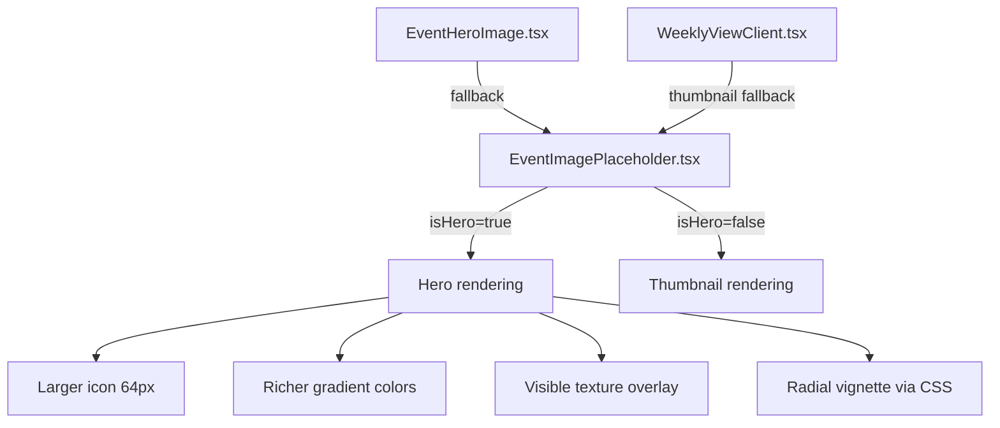

## Problem statement

The event detail hero placeholder (EventHeroImage fallback) renders as a flat monotone gradient
with a tiny centered icon inside a 192px tall block. This is the single most prominent visual
on the detail page and currently looks empty and low-effort compared to editorial products like
Bloomberg or The Economist. The icon is roughly 40px in a 672×192 area — over 95% of the
visual is a flat color wash.

## User story

As a trader viewing an event detail page, I want the hero area to feel intentional and
editorially designed, so that the product feels professional and trustworthy.

## How it was found

Visual-polish review: screenshot 65-event-detail-top.png and 70-event-geopolitical.png both
show large empty hero placeholder areas that look like placeholder content rather than a
finished design.

## Proposed UX

- Enlarge the event-type icon to ~64px (from current ~40px) so it fills the space better
- Add a subtle decorative grid/dot pattern or topographic-style lines within the gradient to
  add visual texture (low-opacity, not distracting)
- Ensure each event type has distinct gradient colors that are richer (currently very pale)
- Add a subtle inner shadow or vignette to create depth
- Keep the rounded-xl corners and responsive width

## Acceptance criteria

- [ ] Hero placeholder icon is visibly larger (~64px)
- [ ] A subtle decorative texture (CSS-only pattern, no images) fills the background
- [ ] Gradient colors have more saturation/contrast than current near-white treatment
- [ ] Each event type has a distinct color personality
- [ ] The treatment looks intentional, not like a loading state
- [ ] No layout shift — same dimensions as before (w-full h-48 rounded-xl)

## Verification

Run all tests. Verify in browser with agent-browser — screenshot the event detail page and
confirm the hero looks polished and editorial.

## Out of scope

- Actual news images or photo sourcing
- AI-generated images
- Animations or transitions on the hero

---

## Planning

### Overview

Modify `src/components/EventImagePlaceholder.tsx` to make the hero-mode rendering more
visually rich. The component already has hero detection (`isHero = className.includes("h-48")`)
and a noise texture overlay at 3.5% opacity. Changes are localized to this single file.

### Research notes

- Current icon size in hero mode: 48px. The viewBox is 24×24, so at 48px it's rendered at 2x.
  At 64px it will be ~2.67x which still renders well with stroke-based icons.
- Current noise texture is at `opacity-[0.035]` — nearly invisible. Increasing to 6-8% will
  make it subtly visible without being distracting.
- The gradient colors are very pale (e.g., `from-amber-100 to-amber-50`). Moving to
  `from-amber-200/70 to-amber-100/40` will add warmth without being garish.
- A CSS radial gradient can create a vignette effect without extra DOM elements.

### Assumptions

- The `isHero` detection via className will continue to work (no planned changes to class usage).
- The component is only used in two places: EventHeroImage and WeeklyViewClient (card thumbnails).
  Changes scoped to `isHero` won't affect card thumbnails.

### Architecture diagram

### One-week decision

**YES** — This is a single-file CSS/JSX change affecting only the hero rendering path.
Under 1 hour of work.

### Implementation plan

1. Update `PLACEHOLDER_COLORS` to use richer gradient stops for hero mode (add a separate
   `HERO_COLORS` map or conditionally apply stronger colors)
2. Increase `iconSize` from 48 to 64 for hero mode
3. Increase noise texture opacity from 0.035 to ~0.06
4. Add a radial gradient overlay for subtle vignette (dark edges → transparent center)
5. Increase icon opacity from `text-foreground/20` to `text-foreground/25` for hero mode
6. Test all 7 event types visually
