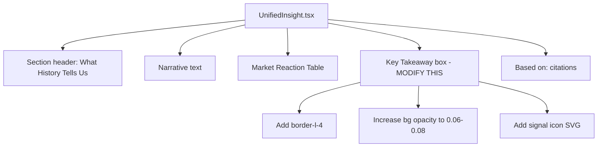

## Problem statement

The "Key Takeaway" section in UnifiedInsight uses `bg-foreground/[0.03]` — a background so
faint (roughly 3% opacity) that it's nearly invisible against the #f8f6f3 page background.
This is the most actionable piece of content on the event detail page (the distilled conclusion
from historical analysis) but it visually blends into the page and is easy to skip over.

## User story

As a trader scanning an event, I want the key takeaway to immediately catch my eye, so that
I can quickly grasp the historical signal without reading everything.

## How it was found

Visual-polish review: screenshot 67-event-detail-middle.png shows the Key Takeaway section
barely distinguishable from surrounding content. The text looks like just another paragraph.

## Proposed UX

- Add a prominent left border accent (3-4px) using the foreground color or a warm accent tone
- Increase background opacity to ~6-8% so the box is clearly distinct
- Add a small icon (e.g., a subtle lightbulb or signal indicator) next to the "Key Takeaway" label
- Ensure the font weight of the takeaway text is medium/semibold for scannability
- Keep the same rounded-lg container but make it visually pop

## Acceptance criteria

- [ ] Key Takeaway box has a visible left border accent
- [ ] Background is distinctly visible (not near-invisible)
- [ ] Section is immediately identifiable when scanning the page
- [ ] Text remains readable with good contrast
- [ ] No layout changes to surrounding sections

## Verification

Run all tests. Verify in browser with agent-browser — screenshot the event detail middle
section and confirm the takeaway box stands out from the narrative text.

## Out of scope

- Changing the takeaway text content or logic
- Adding collapse/expand behavior
- Animations

---

## Planning

### Overview

Modify the Key Takeaway section in `src/components/UnifiedInsight.tsx` (lines 94-101).
The current rendering is a `div` with `bg-foreground/[0.03]` background. Need to add a
left border accent, stronger background, and a small inline icon.

### Research notes

- Current styling: `bg-foreground/[0.03] rounded-lg px-5 py-4`
- The foreground color is `#1a1a1a`, so 3% opacity is approximately `rgba(26,26,26,0.03)` —
  nearly invisible on the `#f8f6f3` background.
- Bloomberg and FT use left-border callout boxes with subtle tinted backgrounds for key insights.
- A `border-l-3` or `border-l-4` with `border-foreground/30` would create a clear visual accent.

### Assumptions

- No other component depends on the Key Takeaway section's styling.
- The takeaway text content comes from `buildTakeaway()` in the same file — not changing logic.

### Architecture diagram

### One-week decision

**YES** — Single section styling change in one file. Under 30 minutes of work.

### Implementation plan

1. Add `border-l-4 border-foreground/25` to the Key Takeaway container
2. Change `bg-foreground/[0.03]` to `bg-foreground/[0.06]`
3. Add a small SVG icon (arrow-trending or signal icon) inline with the "Key Takeaway" heading
4. Change `rounded-lg` to `rounded-r-lg` since the left border replaces the left rounding
5. Verify contrast and readability
