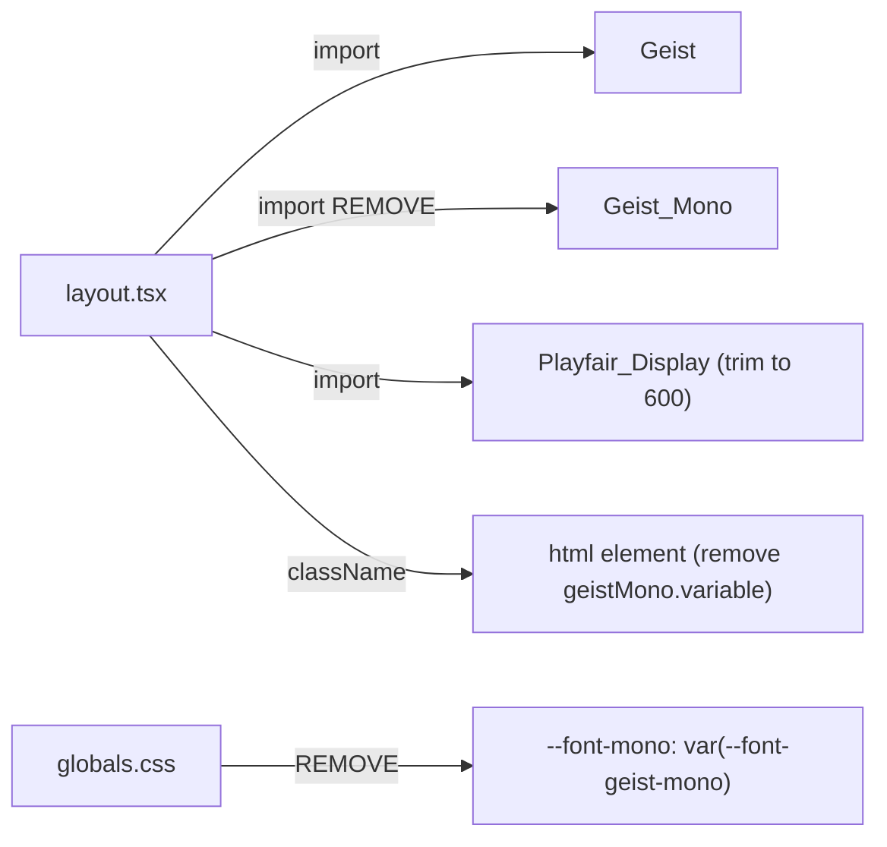

## Problem statement

The app loads `Geist_Mono` from Google Fonts in `layout.tsx` and declares it as `--font-mono` in `globals.css`, but no component ever applies `font-mono` to any element. This wastes ~31KB of font data on every page load. Additionally, `Playfair_Display` loads four weights (400, 500, 600, 700), but only weight 600 (`font-semibold`) is used on `font-serif` elements throughout the app.

## User story

As a visitor, I want the page to load as fast as possible, so that I can read today's market event without waiting for unused resources to download.

## How it was found

Performance review of browser resource loading via `performance.getEntriesByType("resource")` showed three font files totaling ~99KB. Cross-referencing `font-mono` usage across all `.tsx` and `.css` files showed zero uses. Cross-referencing `font-serif` elements showed only `font-semibold` (weight 600) is applied.

## Proposed UX

No visual change. Identical rendering with fewer bytes transferred.

## Acceptance criteria

- [ ] `Geist_Mono` import removed from `layout.tsx`
- [ ] `--font-geist-mono` variable removed from the `className` on `<html>`
- [ ] `--font-mono` line removed from `globals.css`
- [ ] `Playfair_Display` weight array trimmed to `["600"]` only
- [ ] App builds without errors
- [ ] All pages render identically (serif headings still semibold, sans body text unchanged)

## Verification

Run `npm run build` and confirm no errors. Open app in browser and visually confirm no font regressions.

## Out of scope

- Changing font families
- Adding new fonts
- Redesigning typography

---

## Planning

### Overview

Remove the unused `Geist_Mono` font import and trim `Playfair_Display` to only weight 600. Two files need changes: `src/app/layout.tsx` and `src/app/globals.css`.

### Research notes

- `Geist_Mono` is imported in `layout.tsx` line 13-16, applied to `<html>` className, and declared as `--font-mono` in `globals.css` line 24. Zero components use `font-mono`.
- `Playfair_Display` loads weights `["400", "500", "600", "700"]`. Grep of all `.tsx` files shows `font-serif` is only ever paired with `font-semibold` (weight 600). Weights 400, 500, 700 are unused.
- Next.js `next/font/google` self-hosts fonts and generates one file per weight. Removing 3 unused Playfair weights + Geist Mono saves ~60-90KB on initial load.

### Assumptions

- No component will need `font-mono` or non-600 Playfair weights in the near future.

### Architecture diagram

### One-week decision

**YES** — This is a 15-minute change touching 2 files with 4 line edits.

### Implementation plan

1. In `layout.tsx`: remove `Geist_Mono` import, remove `geistMono.variable` from `<html>` className, change Playfair `weight` to `["600"]`
2. In `globals.css`: remove `--font-mono: var(--font-geist-mono);` line
3. Build and verify
