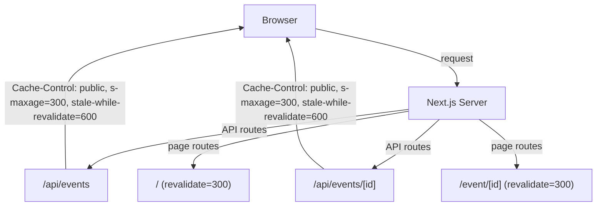

## Problem statement

Both API routes (`/api/events` and `/api/events/[id]`) return no `Cache-Control` header, so browsers re-fetch from the server on every request even when data hasn't changed. Additionally, both page routes use `export const dynamic = "force-dynamic"`, which forces a full server render on every request and prevents Next.js from caching at the framework level. Since events change at most once per day, these responses are highly cacheable.

## User story

As a user toggling between Global and Local scopes, I want previously fetched event data to load instantly from cache, so that scope switching feels instantaneous.

## How it was found

Performance review: `curl -sI "/api/events?scope=global"` showed no `Cache-Control` header. Both `page.tsx` and `event/[id]/page.tsx` have `export const dynamic = "force-dynamic"`. Every page navigation and scope toggle triggers a fresh server render with no caching.

## Proposed UX

No visual change. Scope toggling and page navigation should feel faster on repeat visits. First visit unchanged.

## Acceptance criteria

- [ ] `/api/events` returns `Cache-Control: public, s-maxage=300, stale-while-revalidate=600` header
- [ ] `/api/events/[id]` returns `Cache-Control: public, s-maxage=300, stale-while-revalidate=600` header
- [ ] Home page (`page.tsx`) uses `export const revalidate = 300` instead of `force-dynamic`
- [ ] Event detail page uses `export const revalidate = 300` instead of `force-dynamic`
- [ ] App builds without errors
- [ ] API responses include the cache header (verify with `curl -sI`)

## Verification

Run `npm run build` and `curl -sI` against the API routes. Confirm `Cache-Control` header is present.

## Out of scope

- CDN configuration
- Edge caching setup
- Client-side SWR/React Query caching

---

## Planning

### Overview

Add `Cache-Control` response headers to both API routes and replace `export const dynamic = "force-dynamic"` with `export const revalidate = 300` on both page routes. This enables browser caching for API responses and Next.js ISR caching for server-rendered pages.

### Research notes

- `/api/events` (route.ts) and `/api/events/[id]` (route.ts) return `NextResponse.json()` with no headers.
- `page.tsx` and `event/[id]/page.tsx` both use `export const dynamic = "force-dynamic"`.
- Server-side event cache has 1h TTL, so 5-minute browser/ISR cache is safe and consistent.
- Next.js `revalidate` with page routes that call server functions directly (not `fetch`) uses Next.js ISR.
- The home page uses `fetchEvents()` which does `await import(...)` — compatible with `revalidate`.
- The event detail page calls `fetchEvent(id)` — compatible with `revalidate`.

### Assumptions

- 5-minute (300s) cache TTL is acceptable for an app showing daily events.
- The server-side in-memory cache (1h TTL) already prevents stale data issues.

### Architecture diagram

### One-week decision

**YES** — This is a 20-minute change touching 4 files with simple header additions and config swaps.

### Implementation plan

1. In `src/app/api/events/route.ts`: add `Cache-Control` header to the `NextResponse`
2. In `src/app/api/events/[id]/route.ts`: add `Cache-Control` header to the `NextResponse`
3. In `src/app/page.tsx`: replace `export const dynamic = "force-dynamic"` with `export const revalidate = 300`
4. In `src/app/event/[id]/page.tsx`: replace `export const dynamic = "force-dynamic"` with `export const revalidate = 300`
5. Build and verify headers with `curl -sI`
