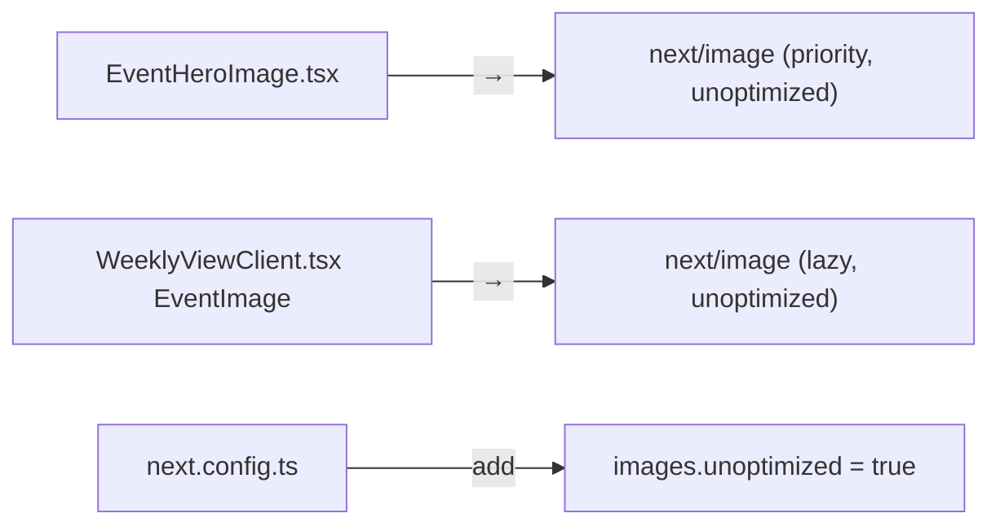

## Problem statement

Both `EventHeroImage.tsx` and the `EventImage` component in `WeeklyViewClient.tsx` use raw `` HTML elements for news images. This means images load eagerly (no lazy loading), are not optimized to WebP/AVIF format, have no responsive sizing, and no priority hints for above-fold images. When real news images are present (from NewsAPI), they load at full size regardless of display dimensions, wasting bandwidth and slowing page load.

## User story

As a user on a slow connection, I want images to load lazily and in optimized formats, so that the page content appears quickly without waiting for off-screen images.

## How it was found

Performance review: Grep for `` tags (`EventHeroImage.tsx` line 26, `WeeklyViewClient.tsx` line 338). No file imports `next/image`. The hero image (672x192) loads eagerly even though the card images below the fold also load eagerly.

## Proposed UX

No visual change. Images render the same but load progressively: above-fold hero image loads with priority, card thumbnails lazy-load as user scrolls.

## Acceptance criteria

- [ ] `EventHeroImage.tsx` uses `next/image` `Image` component with `priority` for the hero image
- [ ] `EventImage` in `WeeklyViewClient.tsx` uses `next/image` `Image` component with `loading="lazy"`
- [ ] `next.config.ts` adds `images.remotePatterns` for expected news image domains (or uses `unoptimized: true` for external URLs if domains are unpredictable)
- [ ] Both components retain the `onError` fallback to `EventImagePlaceholder`
- [ ] App builds without errors
- [ ] Images render correctly in both weekly view and event detail

## Verification

Run `npm run build` and visually verify images render correctly. Check that card images have `loading="lazy"` attribute in the DOM.

## Out of scope

- Image CDN integration
- Custom image optimization pipeline
- Placeholder blurred previews (blur-up)

---

## Planning

### Overview

Replace raw `` tags with Next.js `Image` component in `EventHeroImage.tsx` and the `EventImage` component in `WeeklyViewClient.tsx`. Since news image domains are unpredictable (various news sources), use `unoptimized` prop or configure broad `remotePatterns` in `next.config.ts`.

### Research notes

- `EventHeroImage.tsx` renders a 672x192 hero image with `onError` fallback. It's a client component (`"use client"`). `next/image` works in client components.
- `EventImage` in `WeeklyViewClient.tsx` renders 64x64 thumbnails with `onError` fallback. Also a client component.
- News images come from various domains (NewsAPI aggregates from Reuters, Bloomberg, etc.). Domains are unpredictable, so `remotePatterns` with wildcards or `unoptimized: true` is needed.
- Using `unoptimized` still gets lazy loading and `priority` hints from Next.js Image, just skips the image optimization proxy. This is the safest approach for external URLs with unknown domains.
- `next/image` requires `width` and `height` props (or `fill`). Hero uses 672x192, thumbnails use 64x64.

### Assumptions

- External news image URLs are HTTPS and publicly accessible.
- `unoptimized` mode is acceptable since we can't predict all source domains.

### Architecture diagram

### One-week decision

**YES** — This is a 30-minute change touching 3 files. The `next/image` API is straightforward and both components already have `width`/`height` props.

### Implementation plan

1. In `next.config.ts`: add `images: { unoptimized: true }` (allows any external URL)
2. In `EventHeroImage.tsx`: replace `` with `Image` from `next/image`, add `priority` prop, keep `onError` fallback
3. In `WeeklyViewClient.tsx`: replace `` in `EventImage` with `Image` from `next/image`, use default lazy loading, keep `onError` fallback
4. Build and verify images render correctly
