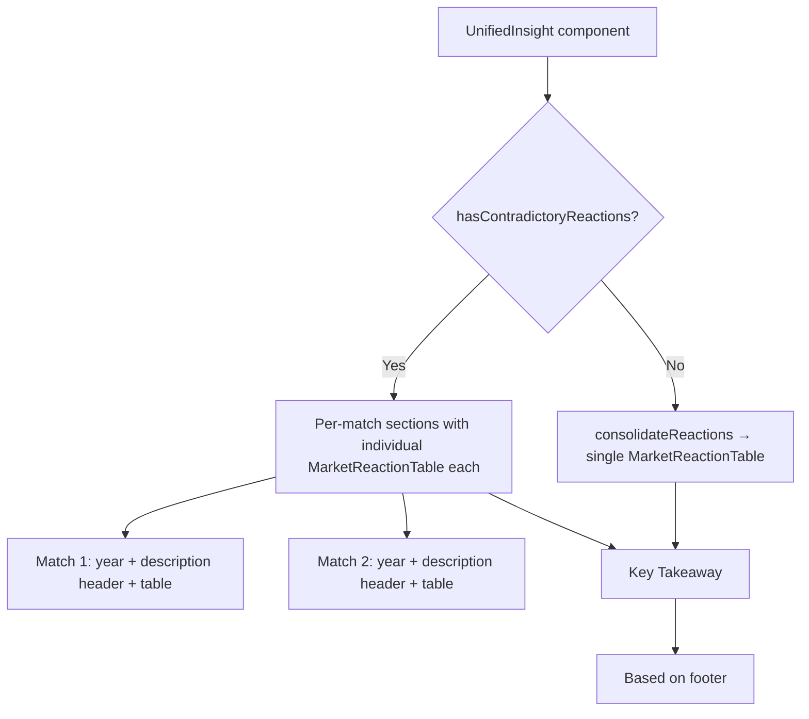

## Problem statement

When an event has multiple historical matches with **contradictory** market reactions for the same asset, the consolidated reaction table averages them into misleading numbers. On the Brent Crude OPEC event (evt-007), Match 1 (2016 OPEC cut) shows Brent Crude **+4.5%** and Match 2 (2020 Saudi price war) shows Brent Crude **-24.1%**. The consolidated table shows **-9.8%** with a "Down" direction — which misrepresents the bullish OPEC cut that the current event actually resembles.

Simultaneously, the Key Takeaway says "Historical precedents show mixed market reactions" while the table shows ALL assets as "Down." This creates a visible contradiction between the takeaway text and the data table.

## User story

As a trader reviewing the Brent Crude event, I want to see each historical precedent's market reaction separately when they disagree, so that I can distinguish between the bullish and bearish scenarios and make an informed decision.

## How it was found

Browsed the event detail page for `evt-007` (Brent Crude Surges Past $95 on OPEC+ Production Cut Extension). The "What History Tells Us" section shows a consolidated table with Brent Crude at -9.8% Day 1, but the narrative explicitly says one match was an "opposite outcome from the same dynamic." The averaged numbers distort the signal from the more relevant match.

## Proposed UX

When all historical matches agree on direction for each asset (same sign), keep the current consolidated view. When matches **disagree** on direction for any asset, show per-match reaction tables instead of a single consolidated one:

- Each match gets its own labeled sub-section with year, short description, and its own reaction table.
- The "Consolidated Market Reaction" header changes to show individual "2016 — OPEC production cut" and "2020 — Saudi price war" sub-tables.
- The Key Takeaway remains but the data tables now clearly separate bullish vs bearish precedents.

## Acceptance criteria

- [ ] When all matches agree on direction for every asset, display the current consolidated table (no regression).
- [ ] When matches disagree on direction for any shared asset, render separate per-match reaction tables with match year/description headers.
- [ ] The Brent Crude event (evt-007) shows two separate tables: one for the 2016 match (bullish) and one for the 2020 match (bearish), not a misleading average.
- [ ] Key Takeaway text still renders correctly in both consolidated and per-match modes.
- [ ] No layout issues — per-match tables stack vertically with clear visual separation.

## Verification

- Open `/event/evt-007` and verify separate tables appear for the two matches.
- Open `/event/evt-001` (Fed event, 2 agreeing matches) and verify consolidated table still appears.
- Run `npm run build` — no build errors.

## Out of scope

- Changing the narrative text generation (`buildNarrative`).
- Changing the affected assets / CTA section.
- Adding match weighting or relevance scoring.

---

## Planning

### Overview

Modify the `UnifiedInsight` component to detect when historical matches produce contradictory reactions for the same asset, and in that case show individual per-match reaction tables instead of a misleading consolidated average.

### Research notes

- `UnifiedInsight` (src/components/UnifiedInsight.tsx) currently always consolidates all matches via `consolidateReactions()` which averages day1Pct and week1Pct per asset.
- `MarketReactionTable` (src/components/MarketReactionTable.tsx) is a pure presentation component — accepts `MarketReaction[]` and renders a table. Reusable as-is.
- `HistoricalMatch` type has `description`, `year`, `whySimilar`, `insight`, and `reactions[]`.
- Mock data: evt-007 has 2 matches with contradictory Brent Crude directions. evt-001 has 2 matches with aligned S&P 500 and Gold directions.
- The `buildTakeaway` function already detects mixed directions but the table doesn't reflect this.

### Assumptions

- "Disagreement" = same asset appears in multiple matches with opposite signs on day1Pct.
- We check for disagreement across ALL shared assets, not just one.

### Architecture diagram

### One-week decision

**YES** — This is a focused change to a single component (~30 lines of new logic). The detection function + conditional rendering can be done in under a day.

### Implementation plan

1. Add a `hasContradictoryReactions(matches)` helper function that checks if any asset appears in multiple matches with opposite day1Pct signs.
2. In `UnifiedInsight`, branch on the result:
   - If no contradictions: render existing consolidated view (no change).
   - If contradictions: render each match as a labeled section with its own `MarketReactionTable`.
3. Style the per-match sections with year/description headers and subtle visual separation.
4. Verify both paths with evt-001 (consolidated) and evt-007 (per-match).
