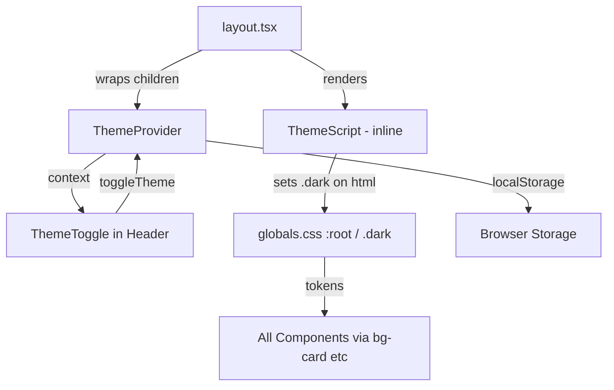

## Problem Statement

The constraints mandate full dark mode support with a user toggle (sun/moon icon) in the header, system preference detection (`prefers-color-scheme`), and localStorage persistence. Currently there is NO dark mode at all — no toggle, no dark CSS variables, and all components hardcode `bg-white` and literal hex colors (`bg-[#E8F5E9]`, `bg-[#FDEDEF]`) that would break in dark mode.

## User Story

As a trader browsing events at night, I want to toggle dark mode so the app doesn't strain my eyes, and I want my preference remembered next time I visit.

## How It Was Found

Browser review of the live app: no dark mode toggle visible in header. Inspected `globals.css` — only light mode CSS variables defined. Found 15+ hardcoded `bg-white`, `bg-[#E8F5E9]`, `bg-[#FDEDEF]` in components.

## Research Notes

- Next.js App Router: can use `<script>` in `layout.tsx` for FOUC prevention (set class before paint)
- Tailwind v4 `@theme` block already has CSS variable references — just need `.dark` overrides
- Components using `bg-white` need migration to `bg-card` (already a Tailwind token via `--color-card`)
- Key hardcoded colors to migrate:
  - `bg-white` → `bg-card` (9 instances)
  - `bg-[#E8F5E9]` → needs new `--success-bg` token (2 instances)
  - `bg-[#FDEDEF]` → needs new `--error-bg` token (2 instances)
  - `shadow-[0_0_13px_rgba(0,0,0,0.08)]` → needs `--card-shadow` token

## Architecture

## One-week Decision

**YES** — This is a 2–3 hour task: add CSS tokens, create context provider, add toggle button, migrate ~15 className references.

## Implementation Plan

### Phase 1: CSS dark mode tokens
1. Add `.dark` selector to `globals.css` overriding `--background`, `--foreground`, `--muted`, `--border`, `--card`, `--card-border`
2. Add new tokens: `--success-bg`, `--error-bg`, `--card-shadow` with light/dark variants
3. Add dark variants to `@theme inline` block

### Phase 2: ThemeProvider + anti-FOUC script
1. Create `src/components/ThemeProvider.tsx` — client component with context
2. Add inline `<script>` in `layout.tsx` to read localStorage/system pref and set `.dark` class before paint
3. Wrap app in ThemeProvider

### Phase 3: Theme toggle in header
1. Create `src/components/ThemeToggle.tsx` — sun/moon icon button
2. Add to header in `layout.tsx` (right side)

### Phase 4: Migrate hardcoded colors
1. Replace all `bg-white` → `bg-card`
2. Replace `bg-[#E8F5E9]` → `bg-[var(--success-bg)]`
3. Replace `bg-[#FDEDEF]` → `bg-[var(--error-bg)]`
4. Replace hardcoded shadows → `shadow-[var(--card-shadow)]`

## Acceptance Criteria

- [ ] `.dark` class on `<html>` activates dark theme
- [ ] ThemeProvider reads localStorage, falls back to system preference
- [ ] Sun/moon toggle in header toggles dark/light
- [ ] Preference persists across page reloads
- [ ] No FOUC on load
- [ ] No hardcoded `bg-white` in components
- [ ] All pages render correctly in both modes

## Out of Scope

- Per-section theme overrides
- Animated theme transitions
