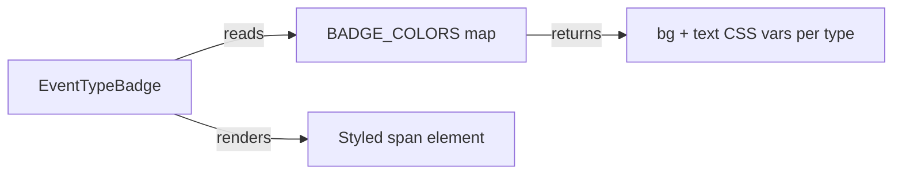

## Problem Statement

All event type badges use identical gray styling. The constraints specify unique color per type.

## User Story

As a trader scanning the weekly view, I want color-coded badges so I can instantly identify event types.

## How It Was Found

Visual review: all badges look the same. Constraints doc has exact color mapping.

## Research Notes

- Current `EventTypeBadge.tsx` applies one style to all types
- Need a lookup map from EventType to { bg, text } colors
- Colors should use CSS variables for dark mode compatibility
- Badge spec: pill, 11px uppercase, weight 600, 4px 10px padding

## Architecture

## One-week Decision

**YES** — 15-minute task: add a color map and apply it.

## Implementation Plan

1. Create `BADGE_COLORS` record mapping each EventType to `{ bg: string, text: string }`
2. Use inline styles for the dynamic bg/text colors (since they vary per type, not feasible as static Tailwind classes)
3. Update badge sizing: `text-[11px]`, `px-2.5 py-1`, `font-semibold`, `uppercase`, `rounded-full`
4. Ensure colors are visible in dark mode

## Acceptance Criteria

- [ ] Each event type has its own distinct color
- [ ] Colors match the constraints spec exactly
- [ ] Badge text is 11px, uppercase, 600 weight
- [ ] Works in both light and dark mode

## Out of Scope

- New event types
- Badge interactions
