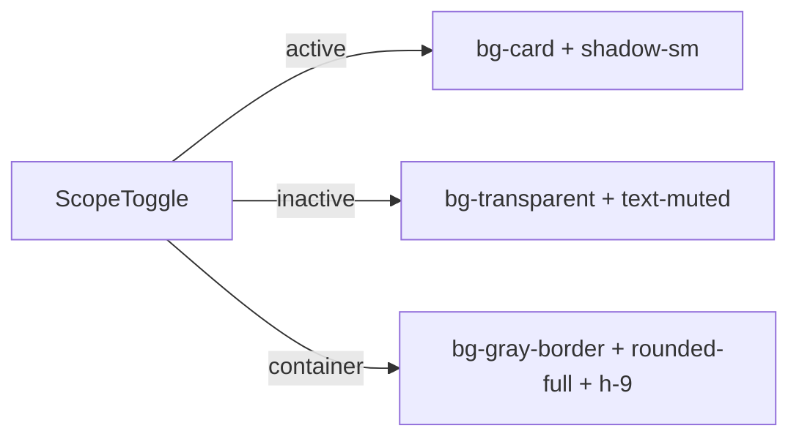

## Problem Statement

The scope toggle uses navy background for active segment. Constraints say: white bg + subtle shadow for active, transparent + gray text for inactive.

## User Story

As a user, I want the scope toggle to match eToro's segmented control so the app feels like an eToro product.

## How It Was Found

Visual comparison against constraints. Active segment uses `bg-navy text-white` but spec says white background.

## Architecture

## One-week Decision

**YES** — 10-minute className update.

## Implementation Plan

1. Update container to `h-9` (36px)
2. Active segment: `bg-[var(--card)] shadow-sm text-[var(--foreground)]`
3. Inactive segment: `bg-transparent text-[var(--gray-text)]`
4. Both segments: `px-3 text-xs font-semibold rounded-full`

## Acceptance Criteria

- [ ] Active segment has white/card background with shadow
- [ ] Inactive segment is transparent with gray text
- [ ] Container is 36px height with round radius
- [ ] Works in dark mode (uses card token)

## Out of Scope

- Moving toggle to header
- Additional scope options
