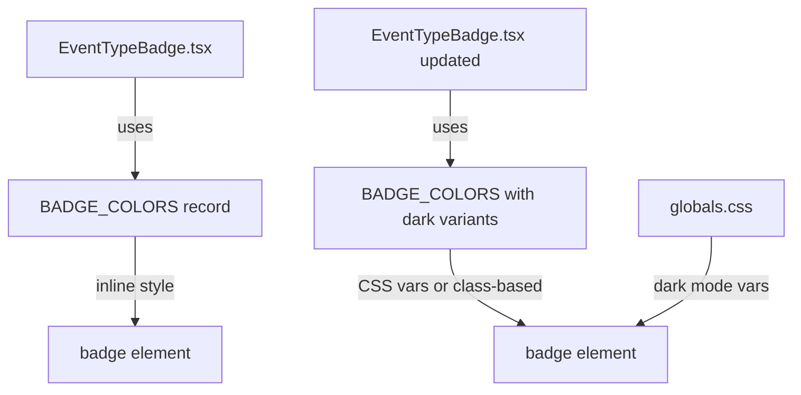

## Problem Statement

Several event type badges have dark text colors that become nearly unreadable against dark mode card backgrounds (`#000021`). Affected badges:

- **Commodities**: text `#374151` on dark card — contrast ratio ~1.7:1 (nearly invisible)
- **Earnings**: text `#B45309` — contrast ratio ~2.7:1
- **Regulation/Lawsuits**: text `#1D4ED8` — contrast ratio ~2.1:1
- **Geopolitical**: text `#6D28D9` — contrast ratio ~1.8:1

WCAG AA requires 4.5:1 for normal text. All four badge types fail badly in dark mode.

The `Rates` (#0EB12E green) and `Layoffs` (#E31937 red) badges are fine because they use brighter colors.

## User Story

As a user browsing events in dark mode, I want to clearly read the event type badge so I can quickly identify what kind of market event each card represents.

## How It Was Found

Observed during edge-case review in the browser. Switched to dark mode on the weekly view and inspected all badge styles. Computed contrast ratios of badge text colors against the dark card background (`#000021`, `rgb(0, 0, 33)`).

## Proposed UX

Use lighter text colors for badges in dark mode while keeping the same 10%-opacity background treatment. In light mode, nothing changes. In dark mode, use the badge's accent color at a higher lightness.

Suggested dark mode text colors:
- **Earnings**: `#FBBF24` (bright amber)
- **Regulation/Lawsuits**: `#60A5FA` (bright blue)
- **Geopolitical**: `#A78BFA` (bright purple)
- **Commodities**: `#9CA3AF` (bright gray)

## Acceptance Criteria

- [ ] All badge types have a contrast ratio of at least 4.5:1 against the dark mode card background
- [ ] Badge appearance in light mode is unchanged
- [ ] Badge colors use CSS custom properties or Tailwind dark: variant to switch between modes
- [ ] Tested visually in both light and dark mode on the weekly view

## Verification

- Run all tests and confirm they pass
- Open the app in the browser, switch to dark mode, and verify all badge types are clearly readable
- Take a screenshot showing the weekly view in dark mode with all badge types visible

## Out of Scope

- Changing badge colors in light mode
- Modifying badge shape, size, or typography
- Changing any other component's dark mode colors

---

## Planning

### Overview

The `EventTypeBadge` component uses inline styles with hardcoded RGB colors for text and background. In dark mode, the card background is `#000021`, and several badge text colors are too dark to read against it. The fix is to detect dark mode and use lighter text color variants.

### Research Notes

- The component is at `src/components/EventTypeBadge.tsx`
- Badge colors are defined in `BADGE_COLORS` as a Record with `{ bg, text }` entries
- Colors are applied via inline `style` attribute, not Tailwind classes
- The app uses Tailwind's `dark:` class strategy with a `.dark` class on `<html>`
- To support dark mode, we can either:
  1. Add a `darkText` property to the BADGE_COLORS record and read the current theme
  2. Switch from inline styles to CSS custom properties that respond to `.dark`
  3. Use Tailwind's `dark:` variant with classes instead of inline styles

Option 2 (CSS custom properties) is cleanest — define variables per badge type in globals.css that change in `.dark` context.

However, the simplest approach is option 1: add a dark variant to each badge color and use a `useTheme` or check `document.documentElement.classList` to select the right one. Since the component currently doesn't use React state, we'd need to make it a client component or use CSS.

**Best approach**: Switch the inline `color` style to a CSS variable approach. Define CSS custom properties for each badge type in `globals.css` with both light and dark values. This keeps the component server-renderable and respects dark mode without JS.

### Assumptions

- The `.dark` class on `<html>` is the standard mechanism for dark mode (confirmed by ThemeProvider)
- The semi-transparent backgrounds at 10% opacity are fine in both modes — only text color needs to change

### Architecture Diagram

### One-Week Decision

**YES** — This is a ~30-minute CSS + component change touching one component and one stylesheet.

### Implementation Plan

1. Add dark text color entries to `BADGE_COLORS` in `EventTypeBadge.tsx`
2. Make the component a client component (add `"use client"`) to access the current theme
3. Use the theme context or a CSS-based approach:
   - Preferred: Define CSS custom properties for badge text colors that change in `.dark` context
   - Add the properties to `globals.css`
   - Reference them via `var(--badge-text-earnings)` etc in the component
4. Verify all 7 badge types have ≥4.5:1 contrast in both modes
