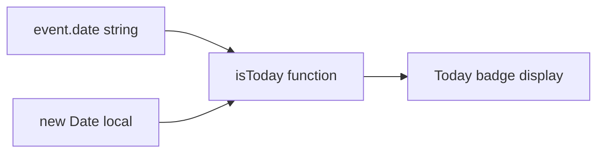

## Problem Statement

The `isToday` function in `WeeklyViewClient.tsx` compares the event date against the UTC date:

```ts
function isToday(dateStr: string): boolean {
  const today = new Date().toISOString().split("T")[0];
  return dateStr === today;
}
```

`new Date().toISOString()` returns UTC time. For users in non-UTC timezones, during certain hours of the day, the UTC date differs from the local date:
- User in UTC+9 (Tokyo) at 1 AM local → UTC date is still the previous day → "Today" badge appears on yesterday's event
- User in UTC-7 (Pacific) at 8 PM local → UTC date is the next day → "Today" badge could appear on tomorrow's event (if present)

## User Story

As a user viewing the weekly event list, I want the "Today" badge to accurately highlight today's event in my local timezone so I can quickly find the current day's market-moving event.

## How It Was Found

Code review of `WeeklyViewClient.tsx` during edge-case testing. The `isToday` function uses `toISOString()` which returns UTC, while the `formatDate` function uses `new Date(dateStr + "T12:00:00")` which parses in local time. The inconsistency means the "Today" badge and the displayed weekday/date could disagree near timezone boundaries.

## Proposed UX

Use the user's local date for the "Today" comparison:

```ts
function isToday(dateStr: string): boolean {
  const now = new Date();
  const today = `${now.getFullYear()}-${String(now.getMonth() + 1).padStart(2, "0")}-${String(now.getDate()).padStart(2, "0")}`;
  return dateStr === today;
}
```

## Acceptance Criteria

- [ ] `isToday` compares against the local date, not UTC
- [ ] The "Today" badge appears on the correct event regardless of the user's timezone
- [ ] Existing tests pass (if any cover this function)
- [ ] The displayed weekday abbreviation and date number remain consistent with the "Today" badge

## Verification

- Run all tests and confirm they pass
- Open the app in the browser and verify the "Today" badge appears on the correct event
- Manually test by logging the comparison values

## Out of Scope

- Adding timezone selection/override
- Changing date display format
- Server-side date handling

---

## Planning

### Overview

Single-function fix in `WeeklyViewClient.tsx`. Replace `toISOString()` (UTC) with local date construction using `getFullYear()`, `getMonth()`, `getDate()`.

### Research Notes

- The function is at line 43-46 of `src/components/WeeklyViewClient.tsx`
- `formatDate` (line 35) already uses local time via `new Date(dateStr + "T12:00:00")` — so the weekday display is in local time
- The fix is to make `isToday` consistent with `formatDate` by using local time
- No other components reference `isToday`

### Assumptions

- Event dates in the API response are in `YYYY-MM-DD` format representing calendar dates (not UTC timestamps)
- The "Today" badge should match the user's local calendar date

### Architecture Diagram



### One-Week Decision

**YES** — This is a single-line function fix.

### Implementation Plan

1. Replace the `isToday` function body to use local date parts instead of `toISOString()`
2. Verify the "Today" badge still appears correctly on the current day's event
3. Build and confirm no type errors
