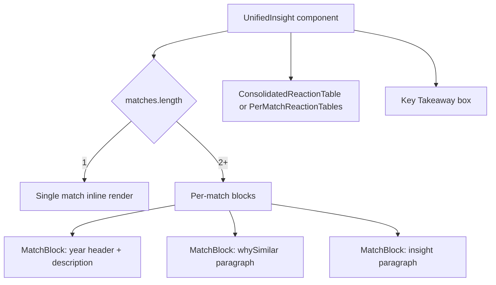

## Problem statement

The "What History Tells Us" section on the event detail page concatenates all historical match narratives (whySimilar + insight) into a single dense paragraph. When there are 2-3 historical matches, this creates a wall of text where a first-time user cannot distinguish which text refers to which historical event.

For example, the Fed Rates event produces:
> "Both events mark the end of a tightening cycle with forward guidance suggesting easing ahead. The 2006 pause came after rates hit 5.25%, similar macro uncertainty. Similar dovish pivot in response to economic uncertainty. In 2019, the Fed shifted from hiking to cutting within months, driven by trade tensions. After the 2006 pause, the S&P 500 rallied 4.2% over the following month as markets priced in the pivot. The 2019 pivot led to three rate cuts and a 10% equity rally in H2 2019."

This is 6 sentences mashed together with no visual separation between the two historical events. The core value proposition of this app — showing historical parallels — is buried in an unscannable paragraph.

## User story

As a first-time user viewing an event detail, I want each historical parallel to be clearly separated and labeled so I can quickly scan the key information (what happened, why it's similar, what the outcome was) without reading a wall of text.

## How it was found

Fresh-eyes browser review (iteration #28). Navigated to the Fed Rates event detail page and observed the "What History Tells Us" section renders as a single paragraph combining two historical events (2006 and 2019 Fed pivots) with no visual separation between them.

## Proposed UX

Replace the single narrative paragraph with per-match blocks. Each block should:
- Have a clear year header (e.g., "2006" or "2019") styled as a bold label
- Show a one-line description of the historical event
- Show the "why similar" reasoning as a distinct paragraph
- Show the insight/outcome

The layout should be vertical — stacked blocks, each visually distinct. Use a subtle left border or card background per block to delineate them.

Keep the consolidated reaction table and key takeaway as-is below the per-match blocks. The "Based on:" footer can be removed since each match is now explicitly labeled.

Single-match events should still render inline (no block structure needed for 1 item).

## Acceptance criteria

- [ ] When an event has 2+ historical matches, each match is rendered as a separate visual block with its year prominently labeled
- [ ] Each block shows: year, event description, why similar, and insight as distinct text sections
- [ ] Single-match events still render cleanly (no unnecessary block wrapper)
- [ ] The consolidated market reaction table remains below the match blocks
- [ ] The key takeaway callout remains at the bottom
- [ ] The "Based on:" footer is removed (redundant now that matches are labeled)
- [ ] All text is readable and scannable — no wall of text

## Verification

- Run all tests and verify no regressions
- Open event detail for evt-001 (Fed Rates, 2 matches) in browser with agent-browser
- Verify each historical match appears as a separate visual block with year header
- Screenshot the result as evidence

## Out of scope

- Changing the market reaction table layout
- Changing the Key Takeaway text logic
- Adding new data fields to matches

---

## Planning

### Overview

Replace the single `buildNarrative()` paragraph in `UnifiedInsight.tsx` with per-match blocks. The component already has `PerMatchReactionTables` as a pattern for per-match rendering — apply the same idea to the narrative text.

### Research notes

- `UnifiedInsight.tsx` (lines 36-44): `buildNarrative()` joins all `whySimilar` and `insight` strings into one paragraph.
- `HistoricalMatch` type has: `description`, `year`, `whySimilar`, `insight`, `reactions[]`.
- The component already handles per-match tables for contradictory reactions (`PerMatchReactionTables`).
- Single-match events should render inline (no wrapper).
- The "Based on:" footer (lines 173-181) can be removed since match attribution will be inline.

### Assumptions

- No changes to the `HistoricalMatch` type are needed.
- The consolidated market reaction table and key takeaway remain unchanged.

### Architecture diagram

### One-week decision

**YES** — This is a single-component refactor. Estimated 1-2 hours of work. The data is already available in the `matches` prop. Only the rendering changes.

### Implementation plan

1. Remove the `buildNarrative()` function.
2. Create a `MatchBlock` sub-component that renders a single historical match with:
   - Year as a bold label (e.g., "2006")
   - Description in medium weight
   - `whySimilar` as a paragraph
   - `insight` as a styled quote or distinct paragraph
3. In `UnifiedInsight`, replace the single `
{narrative}
` with:
   - If 1 match: render a single `MatchBlock` without extra wrapping
   - If 2+ matches: render each match as a `MatchBlock` with visual separation (e.g., left border or subtle card, spaced vertically)
4. Remove the "Based on:" footer since each match now has its year/description inline.
5. Verify in browser with evt-001 (2 matches) and another event with 1 match.
