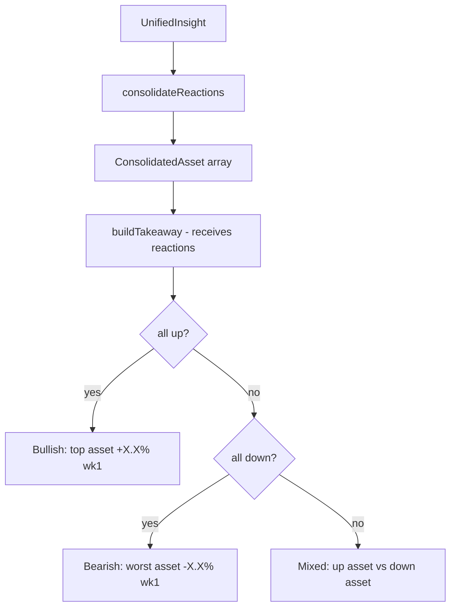

## Problem statement

The Key Takeaway box at the bottom of "What History Tells Us" always shows a generic sentence like "Historical precedents suggest a broadly positive market reaction to this type of event." This is the same text for ANY bullish event, regardless of the specific assets or magnitude of the reactions.

For a first-time user who has just read the historical analysis and market reaction table, this generic takeaway feels like a letdown — it doesn't summarize the actual data shown above it. The takeaway should be the most valuable sentence on the page, but it's the most generic.

## User story

As a first-time user reading the event detail, I want the Key Takeaway to mention the specific top-performing asset and approximate magnitude so I immediately understand the actionable signal without re-reading the table.

## How it was found

Fresh-eyes browser review (iteration #28). Viewed the Fed Rates event detail and noticed the Key Takeaway says "broadly positive" without mentioning S&P 500 (+2.1% week 1), Gold (+2.3% week 1), or any specific numbers — even though all this data is in the table right above it.

## Proposed UX

Make the `buildTakeaway` function data-driven. When all matches agree on direction:
- Mention the top-performing asset by name and its average Week 1 percentage
- Example: "Historical parallels suggest bullish momentum — Gold averaged +2.3% over one week in similar past events."

When matches disagree:
- Mention the split, e.g. "Mixed signals: S&P 500 tended up (+1.5% wk1) while EUR/USD went down (-0.8%)."

Keep the sentence concise (1-2 sentences max). Use the consolidated reaction data already computed in `UnifiedInsight`.

## Acceptance criteria

- [ ] Key Takeaway mentions at least one asset name and one percentage figure from the consolidated reaction data
- [ ] Bullish events reference the top asset by Week 1 performance
- [ ] Bearish events reference the most impacted asset by Week 1 performance
- [ ] Mixed events mention the split (one up, one down)
- [ ] Text remains 1-2 sentences, not a paragraph
- [ ] Single-match events still render a useful takeaway

## Verification

- Run all tests and verify no regressions
- Open event detail for evt-001 (Fed Rates) in browser
- Verify the Key Takeaway mentions a specific asset and percentage
- Open event detail for a bearish event and verify the takeaway reflects negative data
- Screenshot as evidence

## Out of scope

- Changing the Key Takeaway visual design (box, border, icon)
- Adding new sections or CTAs
- Changing the market reaction table

---

## Planning

### Overview

Make the `buildTakeaway()` function in `UnifiedInsight.tsx` data-driven by passing the consolidated reaction data and referencing the top-performing asset by name and Week 1 percentage.

### Research notes

- `buildTakeaway()` (lines 46-63) currently returns hardcoded strings based only on direction consensus.
- The `consolidateReactions()` function (lines 8-34) already produces per-asset averages with `day1Pct` and `week1Pct`.
- The consolidated data is computed in the `UnifiedInsight` render but not passed to `buildTakeaway()`.
- Need to find the top asset by absolute `week1Pct` and format the takeaway.

### Assumptions

- No changes to the data model needed.
- The takeaway should remain 1-2 sentences.
- Asset names from the consolidated data can be used as-is (e.g., "S&P 500", "Gold").

### Architecture diagram

### One-week decision

**YES** — This is a small function change in one component. Estimated 30 minutes of work.

### Implementation plan

1. Modify `buildTakeaway()` to accept `ConsolidatedAsset[]` as a parameter.
2. Find the asset with the largest absolute `week1Pct`.
3. For bullish consensus: "Historical parallels suggest bullish momentum — {asset} averaged +{pct}% over one week in similar past events."
4. For bearish consensus: "Historical parallels suggest bearish pressure — {asset} averaged {pct}% over one week in similar past events."
5. For mixed: "Mixed signals — {upAsset} tended up (+{pct}%) while {downAsset} dropped ({pct}%) over one week."
6. Update the `UnifiedInsight` component to pass consolidated reactions to `buildTakeaway()`.
7. Verify with evt-001 and a bearish event.
