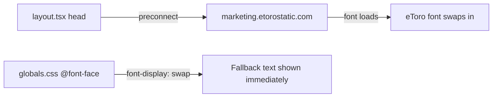

## Problem statement

The eToro variable font (338KB TTF) is loaded from `marketing.etorostatic.com` without `font-display: swap` in the `@font-face` declaration and without a `<link rel="preconnect">` hint. Browser performance data shows the font takes 581ms to load, and without `font-display: swap` the browser defaults to a block period where text is invisible (FOIT). Additionally, the browser only discovers the font URL when parsing the CSS, meaning DNS lookup + TCP + TLS handshake for `marketing.etorostatic.com` starts late.

## User story

As a visitor, I want to see text immediately when the page loads, so that I'm not staring at invisible content while the custom font downloads.

## How it was found

Performance review using browser performance API:
- Font starts loading at 82ms, finishes at 662ms (581ms duration)
- First contentful paint at 132ms
- Load event delayed to 663ms — directly blocked by font
- `font-display` is completely absent from the `@font-face` in `globals.css`
- No `<link rel="preconnect">` in `layout.tsx`

## Proposed UX

- Text appears immediately using fallback fonts (Inter, system fonts)
- Font swaps in seamlessly once loaded (~500ms later)
- No visible delay or invisible text period

## Acceptance criteria

- [ ] `@font-face` in `globals.css` includes `font-display: swap`
- [ ] `<link rel="preconnect" href="https://marketing.etorostatic.com" crossorigin>` added to `<head>` in `layout.tsx`
- [ ] First contentful paint shows readable text even before eToro font loads
- [ ] No FOIT on cold cache load

## Verification

- Run `npm run build` successfully
- Inspect `globals.css` for `font-display: swap`
- Inspect `layout.tsx` for preconnect link

## Out of scope

- Hosting the font locally
- Converting font format to WOFF2
- Subsetting the font

---

## Planning

### Overview

Add `font-display: swap` to the existing `@font-face` rule in `globals.css` and add a `<link rel="preconnect">` element in `layout.tsx` to start the connection to the font CDN earlier.

### Research notes

- The eToro font is 338KB TTF served from `marketing.etorostatic.com` with 1-year cache headers
- Without `font-display: swap`, browsers use `auto` behavior which typically means a 3-second block period (FOIT)
- `preconnect` saves DNS + TCP + TLS overhead (~100-200ms)
- Next.js `<head>` in `layout.tsx` supports raw `<link>` elements

### Assumptions

- The eToro CDN supports CORS for preconnect (confirmed: `access-control-allow-origin: *`)

### Architecture diagram

### One-week decision

**YES** — This is a 2-line change across 2 files. Trivially fits in one day.

### Implementation plan

1. Add `font-display: swap;` to the `@font-face` rule in `src/app/globals.css`
2. Add `<link rel="preconnect" href="https://marketing.etorostatic.com" crossOrigin="anonymous" />` to the `<head>` in `src/app/layout.tsx`
3. Build and verify
