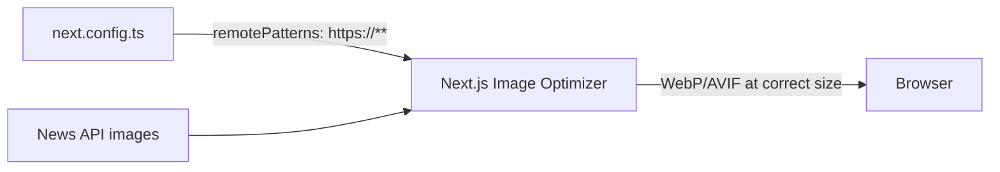

## Problem statement

The `next.config.ts` has `images: { unoptimized: true }` which completely disables Next.js Image component optimization. This means:
- No automatic WebP/AVIF format conversion
- No responsive image sizing
- No built-in lazy loading optimization
- Images are served at full original size regardless of display dimensions

This was likely set as a workaround because news API images come from external domains that need `remotePatterns` configuration. The correct fix is to configure `remotePatterns` to allow the external domains while keeping optimization enabled.

## User story

As a user on a slower connection, I want images to be optimized (smaller formats, correct sizing) so that pages load faster and use less bandwidth.

## How it was found

Inspected `next.config.ts` and found `images: { unoptimized: true }`. The previous task `trade-the-past-use-nextjs-image` added `next/image` usage but the config defeats its purpose. The `EventHeroImage` component specifies `width={672} height={192}` but with `unoptimized: true`, the original full-size image is served.

## Proposed UX

- Images on event cards and hero sections load in optimized format (WebP where supported)
- Thumbnail images (64x64) are served at correct size instead of full resolution
- Hero images served at appropriate width for viewport

## Acceptance criteria

- [ ] `images.unoptimized` removed from `next.config.ts` (or set to `false`)
- [ ] `images.remotePatterns` configured to allow common news image CDN domains (at minimum a wildcard pattern for HTTPS sources)
- [ ] `npm run build` succeeds without image-related errors
- [ ] Images still render correctly on weekly view and event detail

## Verification

- Run `npm run build` successfully
- Verify images render on both weekly view and event detail pages
- Check that `next.config.ts` no longer has `unoptimized: true`

## Out of scope

- Adding blur placeholders
- Image CDN / custom loader
- Responsive `sizes` attribute tuning

---

## Planning

### Overview

Replace `images: { unoptimized: true }` in `next.config.ts` with a proper `remotePatterns` configuration that allows external news image domains. This re-enables Next.js Image optimization (WebP/AVIF conversion, responsive sizing).

### Research notes

- Next.js `remotePatterns` supports wildcards: `{ protocol: "https", hostname: "**" }` allows all HTTPS sources
- News images come from various CDN domains (e.g., `cdn.cnn.com`, `ichef.bbci.co.uk`, etc.) — a broad pattern is most practical for a news aggregator
- With optimization enabled, `next/image` will serve WebP at requested dimensions, significantly reducing bandwidth

### Assumptions

- A broad HTTPS wildcard pattern is acceptable since all images are editorially sourced from news APIs
- The dev server and production build both handle image optimization

### Architecture diagram

### One-week decision

**YES** — Single config file change. Fits in under an hour.

### Implementation plan

1. Replace `images: { unoptimized: true }` in `next.config.ts` with `images: { remotePatterns: [{ protocol: "https", hostname: "**" }] }`
2. Build and verify images still render on both pages
3. Confirm image requests go through `/_next/image` optimizer
