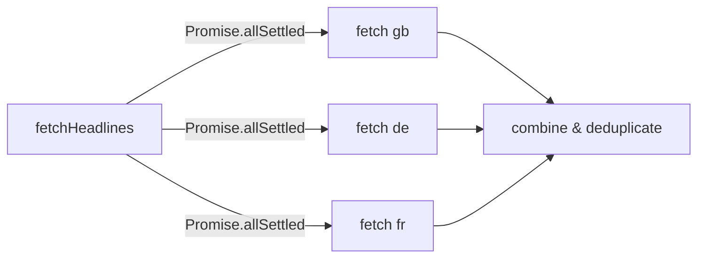

## Problem statement

The `fetchHeadlines` function in `src/lib/news-client.ts` fetches news for each country sequentially using a `for...of` loop. For the "local" scope, this means 3 sequential HTTP requests (gb, de, fr) where each must complete before the next starts. This creates an unnecessary API waterfall that adds latency proportional to the number of countries.

## User story

As a user switching to Local scope, I want events to load as fast as possible so that the toggle feels responsive.

## How it was found

Code review of `src/lib/news-client.ts` during performance review. The `fetchHeadlines` function at lines 23-45 uses `for (const country of countries)` which is sequential. For 3 countries with ~200ms each, this adds ~400ms unnecessary latency vs parallel execution.

## Proposed UX

- No visible UX change — same data, loaded faster
- Local scope toggle should feel snappier

## Acceptance criteria

- [ ] `fetchHeadlines` uses `Promise.allSettled()` (or `Promise.all()` with per-request error handling) to fetch all countries in parallel
- [ ] Failed individual country requests don't break other countries' results
- [ ] Deduplication still applied to the combined results
- [ ] Existing tests continue to pass
- [ ] `npm run build` succeeds

## Verification

- Run `npm run build` successfully
- Code inspection: verify `Promise.allSettled` or equivalent parallel pattern

## Out of scope

- Adding rate limiting
- Changing the NewsAPI integration
- Adding new countries

---

## Planning

### Overview

Refactor `fetchHeadlines` in `src/lib/news-client.ts` to fetch all countries in parallel using `Promise.allSettled()` instead of a sequential `for...of` loop.

### Research notes

- Current code: `for (const country of countries)` with `await fetch()` inside — sequential
- For "local" scope: 3 countries (gb, de, fr), each ~200ms = ~600ms sequential vs ~200ms parallel
- `Promise.allSettled()` is preferred over `Promise.all()` because individual country failures should not break the whole request
- NewsAPI free tier has 100 requests/day limit — parallel requests count the same as sequential

### Assumptions

- NewsAPI doesn't rate-limit concurrent requests from the same API key
- The deduplication function works the same on combined results regardless of fetch order

### Architecture diagram

### One-week decision

**YES** — Small refactor of one function. Fits in under an hour.

### Implementation plan

1. Replace the `for...of` loop in `fetchHeadlines` with `Promise.allSettled()` on an array of fetch promises
2. Filter for fulfilled results, flatten articles
3. Apply existing `deduplicateArticles` to combined results
4. Build and verify
