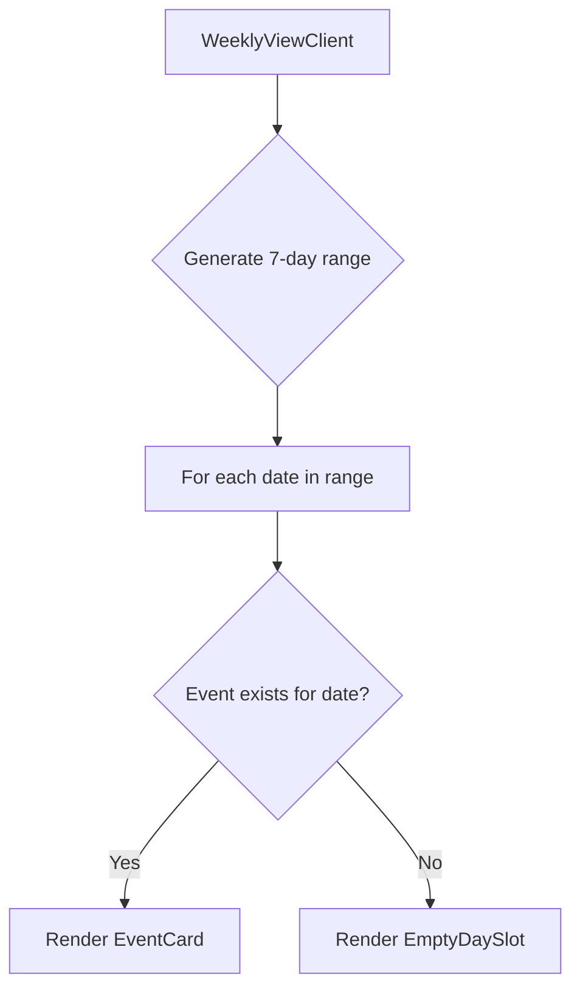

## Problem statement

When users switch to Local scope (UK / DE / FR), the weekly view only shows 4 of 7 days — days without local events (Fri Apr 10, Sun Apr 12, Wed Apr 8 this week) are simply omitted from the list. This creates visual jumps (Tue→Mon→Sat→Thu) that break the consistent "one event per day" editorial cadence and make local scope feel incomplete or broken.

## User story

As a trader browsing UK/DE/FR events, I want to see all 7 days of the week consistently, so that I understand at a glance which days had no notable local events rather than thinking data is missing.

## How it was found

During a complete user journey through the local scope weekly view, navigating from the landing page and toggling to "UK / DE / FR". The weekly view showed 4 cards (Tue 14, Mon 13, Sat 11, Thu 9) with Fri 10, Sun 12, and Wed 8 completely missing. Confirmed via API: `GET /api/events?scope=local` returns only 4 events.

## Proposed UX

For any days in the current week that have no event, show a subtle, muted placeholder row in the weekly view. The row should:
- Show the same date column (weekday, day number, month) as a regular event card
- Instead of an event card, show a single line of muted text like "No notable local event"
- Use a lighter, more subdued styling than real event cards (no shadow, lower opacity, no hover effect)
- Not be clickable

This maintains the 7-row weekly rhythm and clearly communicates "we checked, nothing happened."

## Acceptance criteria

- [ ] In local scope, all 7 days of the current week are always visible
- [ ] Days without events show a muted placeholder row with the date and "No notable local event" text
- [ ] Placeholder rows are NOT clickable (no link, no hover effect)
- [ ] Placeholder rows use subdued styling (no card shadow, muted text)
- [ ] Global scope is unaffected (it already shows all 7 days)
- [ ] Works correctly in both light and dark mode
- [ ] Placeholder rows maintain the same date column width and alignment as event cards

## Verification

- Run the app and toggle to Local scope
- Confirm all 7 days appear (Tue through Wed)
- Confirm missing days show muted placeholder text
- Toggle back to Global and confirm no change
- Test in dark mode

## Out of scope

- Adding fake events for missing days
- Changing the API to return placeholder data
- Modifying global scope behavior

## Planning

### Overview

Pure frontend change in `WeeklyViewClient.tsx`. When rendering the event list, compute the full 7-day date range for the current week, then for any date that has no matching event, insert a muted placeholder row.

### Research notes

- Events come from `getEvents(scope)` sorted by date descending
- The weekly view already handles empty state (zero events) with `EmptyState` component
- Each event has a `date` field as `YYYY-MM-DD` string
- The view currently iterates `events.map(...)` — need to iterate the full date range instead

### Architecture diagram

### One-week decision

**YES** — This is a small UI change confined to `WeeklyViewClient.tsx`. A helper function to generate the date range, a new `EmptyDaySlot` component, and modifying the render loop. ~1 hour of work.

### Implementation plan

1. Add a `getWeekDates()` helper that returns an array of 7 date strings (today through 6 days ago), sorted descending
2. Create an `EmptyDaySlot` component that renders a muted row with the date column and "No notable local event" text
3. In the render section, map over `getWeekDates()` instead of `events`, looking up each date in the events array
4. Only apply this behavior when events are loaded (not during loading state) and when NOT in global scope (global always has 7 events)
