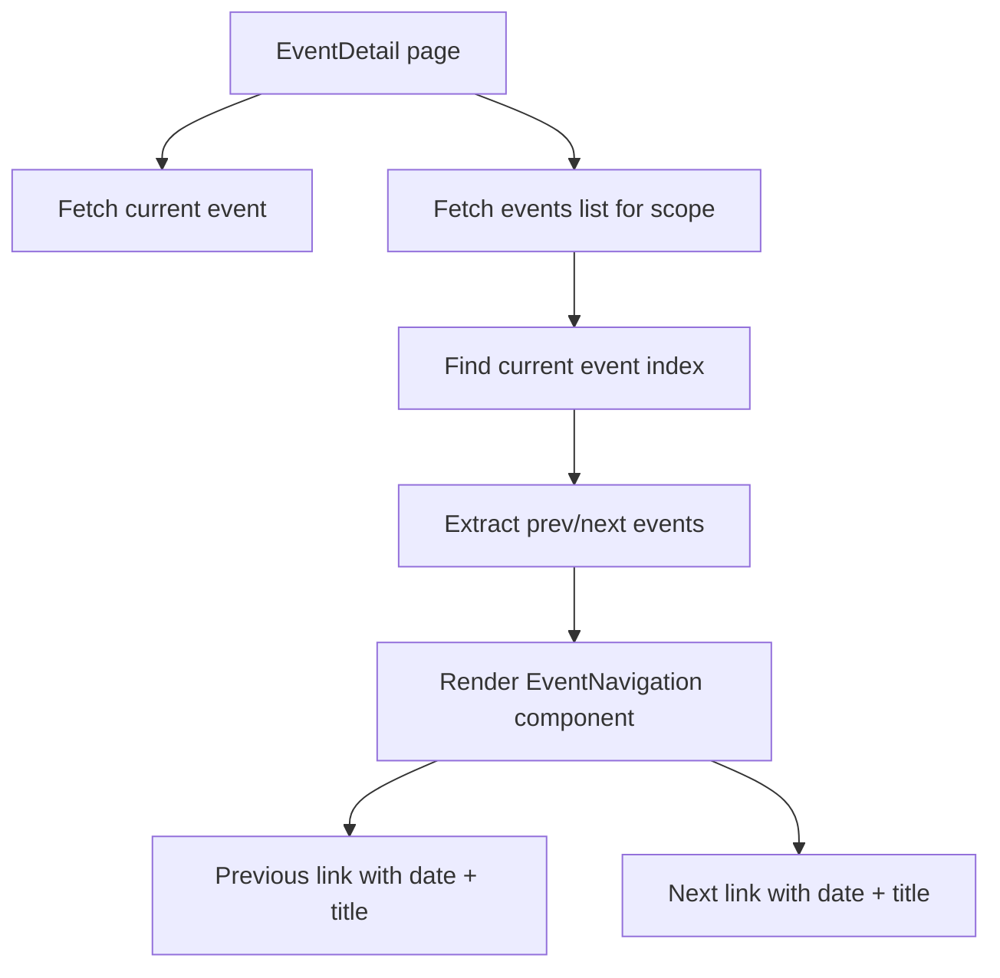

## Problem statement

On the event detail page, the user's only navigation options are "< This Week" (back to weekly view) or external CTAs (Trade/Watchlist). To read through the week's events, users must navigate back to the weekly view after each event and click the next card — a tedious loop that adds friction to the core reading flow.

## User story

As a trader reading through this week's events, I want to navigate directly to the next or previous day's event, so that I can quickly browse the full week without returning to the weekly view after each one.

## How it was found

During end-to-end user journey testing: after reading the Fed Rates event detail, the only way to see the Tesla Earnings event was to click "< This Week", scroll to the Tesla card, and click it. Repeating this for all 7 events requires 14 navigations instead of 7.

## Proposed UX

Add a navigation bar at the bottom of the event detail page (between the Affected Assets section and the footer), with:
- "← Previous" on the left (links to the previous day's event) showing the date and a truncated title
- "Next →" on the right (links to the next day's event) showing the date and a truncated title
- If on the first event of the week, hide the "Previous" link
- If on the last event, hide the "Next" link
- Maintain scope context (`from_scope=local` in URLs if coming from local scope)
- Subtle styling: muted text, with date and short title preview, chevron arrows

## Acceptance criteria

- [ ] Event detail page shows prev/next navigation at the bottom
- [ ] Previous links to the chronologically earlier event; Next links to the later one
- [ ] Edge events (first/last of the week) show only the applicable direction
- [ ] Scope context is preserved in the navigation URLs
- [ ] Navigation works correctly in both Global and Local scopes
- [ ] Works in light and dark mode
- [ ] Navigation bar has clean, editorial styling consistent with the rest of the detail page

## Verification

- Open first event → only "Next" link visible
- Click "Next" → navigates to the next event
- On the last event → only "Previous" link visible
- Test from local scope and confirm scope is preserved

## Out of scope

- Keyboard shortcuts (arrow keys)
- Swipe gestures on mobile
- Infinite scroll through events

## Planning

### Overview

Add a `EventNavigation` component to the event detail page that shows prev/next links to adjacent events in the same scope. The detail page (`event/[id]/page.tsx`) is a server component, so we can fetch the event list server-side and determine adjacent events.

### Research notes

- Event detail page receives `searchParams.from_scope` to know the scope
- `getEvents(scope)` returns events sorted by date descending
- Events have `id` field used for routing
- The detail page is a server component — can call `getEvents()` directly
- Need to find the current event in the list and extract prev/next

### Architecture diagram

### One-week decision

**YES** — Small feature: fetch the event list, find adjacent items, render a navigation component. All in a single server component page. ~2 hours of work.

### Implementation plan

1. In `event/[id]/page.tsx`, call `getEvents(scope)` to get the full event list for the current scope
2. Find the current event's index in the list
3. Extract prev/next events (accounting for descending date sort — "next" = older event below, "prev" = newer event above)
4. Create an `EventNavigation` component that renders prev/next links with date and truncated title
5. Pass `from_scope` through the navigation URLs
6. Style with muted text, chevron arrows, and subtle separating border
