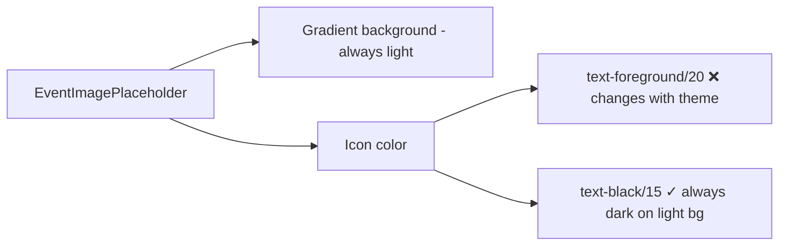

## Problem statement

In dark mode, the event type SVG icons inside card-size image placeholders are nearly invisible. The icons use `text-foreground/20` which resolves to white at 20% opacity in dark mode, but the placeholder gradient backgrounds remain light-colored (e.g., #E8F5E9 for earnings). White icons on light backgrounds have virtually zero contrast, making the icons disappear in dark mode card thumbnails.

## User story

As a user browsing events in dark mode, I want to see the event type placeholder icons clearly, so that I get a visual cue about the event type before clicking into the detail page.

## How it was found

During dark mode user journey testing. Compared screenshot 127 (light mode) where icons are clearly visible against the light gradients, with screenshot 134 (dark mode) where card thumbnail placeholders show colored gradient blocks but no visible icons. The hero-size icons (detail page) are slightly more visible at 25% opacity but still low contrast.

## Proposed UX

Use a theme-independent icon color that maintains contrast against the always-light gradient backgrounds. Since the gradient colors (`PLACEHOLDER_COLORS`) are hardcoded light colors that don't change in dark mode, the icon color should also remain dark. Replace `text-foreground/20` and `text-foreground/25` with a fixed dark color at low opacity (e.g., `text-black/15` for cards, `text-black/20` for hero).

## Acceptance criteria

- [ ] Placeholder SVG icons are visible in both light and dark mode
- [ ] Icons maintain appropriate subtlety (not too bold, still decorative)
- [ ] Card-size (16x16 area) and hero-size (h-48) placeholders both show icons
- [ ] No visual regression in light mode
- [ ] All event types (earnings, layoffs, regulation, interest-rates, geopolitical, commodity-shocks) show their icons

## Verification

- Toggle dark mode on the weekly view
- Confirm all card thumbnails show their event type icons
- Navigate to an event detail page and confirm hero icon is visible
- Toggle back to light mode and confirm no regression

## Out of scope

- Changing the gradient colors for dark mode
- Adding dark-mode-specific gradient variants
- Modifying icon SVG paths or sizes

## Planning

### Overview

One-line fix in `EventImagePlaceholder.tsx`. The gradient backgrounds (`PLACEHOLDER_COLORS`) are hardcoded light colors that don't change with theme. The icon color uses `text-foreground/20` which flips to white in dark mode — white icons on light backgrounds = invisible. Fix by using a fixed dark color.

### Research notes

- `PLACEHOLDER_COLORS` uses light pastel gradients (e.g., `#E8F5E9`) — same in light and dark mode
- Line 132: `text-foreground/20` for card icons, `text-foreground/25` for hero icons
- In light mode: foreground = `#1A1A1A` → dark icon on light bg = visible
- In dark mode: foreground = `#FFFFFF` → white icon on light bg = invisible

### Architecture diagram

### One-week decision

**YES** — Single line change. Replace `text-foreground/20` with `text-black/15` and `text-foreground/25` with `text-black/20`. ~5 minutes.

### Implementation plan

1. In `EventImagePlaceholder.tsx` line 132, change the icon wrapper class from `text-foreground/20` (card) and `text-foreground/25` (hero) to `text-black/15` and `text-black/20` respectively
2. Verify visually in both light and dark mode
