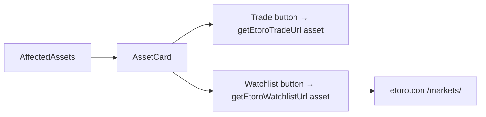

## Problem statement

Every Watchlist CTA button on the event detail page links to the same generic URL (`https://www.etoro.com/watchlists`) regardless of which asset card it belongs to. A user clicking "Watchlist" on Gold expects to add Gold to their watchlist, but they land on a generic watchlists page with no pre-selection. This creates a dead-end UX where the user must then manually search for the asset on eToro.

## User story

As a trader who wants to watch an affected asset, I want the Watchlist button to take me to that specific asset's page on eToro, so that I can add it to my watchlist directly without extra navigation.

## How it was found

During end-to-end user journey testing of the CTA flow. Inspected all CTA link destinations: Trade buttons correctly link to asset-specific pages (e.g., `/markets/gold`), but all Watchlist buttons point to the same `/watchlists` URL. Verified via DOM inspection that `getEtoroWatchlistUrl()` returns a static string.

## Proposed UX

Change the Watchlist button to link to the same asset-specific eToro market page as the Trade button (e.g., `https://www.etoro.com/markets/gold`). From the asset page, users can both trade and add to their watchlist. Update `getEtoroWatchlistUrl()` to accept an asset name and return the asset page URL.

## Acceptance criteria

- [ ] Each Watchlist button links to the specific asset's eToro market page (same URL pattern as Trade)
- [ ] `getEtoroWatchlistUrl()` accepts an asset name parameter
- [ ] Existing `getEtoroTradeUrl()` behavior is unchanged
- [ ] All Watchlist links open in new tab (`target="_blank"`)
- [ ] Unknown assets use the same fallback slug logic as Trade URLs

## Verification

- Open an event detail page
- Inspect each Watchlist button's href
- Confirm each links to the specific asset (e.g., S&P 500 → /markets/spx500)
- Confirm Trade buttons still work correctly

## Out of scope

- Deep-linking to eToro's "add to watchlist" action
- Creating separate watchlist-specific URLs
- Changing the visual style of the Watchlist button

## Planning

### Overview

Modify `getEtoroWatchlistUrl()` in `etoro-slugs.ts` to accept an asset name and return the asset-specific market page URL (same as `getEtoroTradeUrl()`). Update the call site in `AffectedAssets.tsx`.

### Research notes

- `getEtoroWatchlistUrl()` currently returns static `https://www.etoro.com/watchlists`
- `getEtoroTradeUrl(assetName)` returns `https://www.etoro.com/markets/<slug>`
- `AffectedAssets.tsx` line 123: `href={getEtoroWatchlistUrl()}`
- The asset page on eToro has both trade and watchlist functionality

### Architecture diagram

### One-week decision

**YES** — Two files to change: update function signature in `etoro-slugs.ts` and pass asset name at call site in `AffectedAssets.tsx`. Update test if one exists. ~15 minutes.

### Implementation plan

1. In `etoro-slugs.ts`, modify `getEtoroWatchlistUrl()` to accept an optional `assetName` parameter and return the asset-specific market page URL when provided
2. In `AffectedAssets.tsx`, pass `asset.asset` to `getEtoroWatchlistUrl(asset.asset)`
3. Update `etoro-slugs.test.ts` if it tests `getEtoroWatchlistUrl()`
